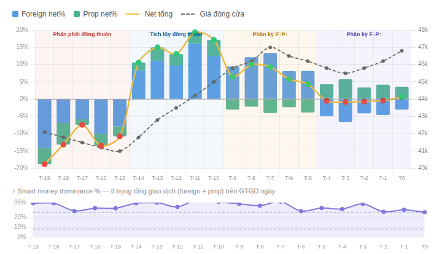
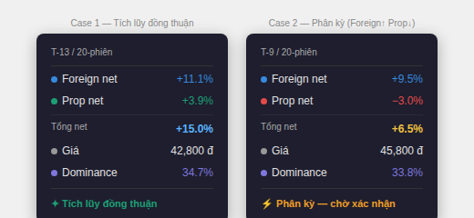

**Smart Money Flow Chart**

Technical Specification - Developer Guide

Phiên bản 1.5 · Stock Screener Module · HOSE / HNX

# **1\. Tổng quan**

Chart Smart Money Flow hiển thị hành vi giao dịch ròng của khối ngoại (foreign) và tự doanh (proprietary) dưới dạng stacked bar kết hợp đường net tổng hợp - vừa thấy đóng góp từng thành phần, vừa đọc được tổng smart money ngay lập tức kể cả trong trường hợp 2 thành phần ngược chiều.

### **Mục tiêu**

- Stacked bar 2 series: foreign và prop chồng lên nhau - thấy tỉ lệ đóng góp từng thành phần
- Đường net tổng (vàng) overlay: luôn đọc được tổng net% chính xác trong mọi trường hợp
- Dot màu trên đường net: xanh lá khi dương, đỏ khi âm - nhìn 1 giây biết chiều smart money
- Dominance % panel riêng: đánh giá mức độ chi phối của smart money so với tổng GTGD

### **Nguồn dữ liệu**

| **Dữ liệu**          | **API call (vnstock)**                 | **Tần suất** |
| -------------------- | -------------------------------------- | ------------ |
| Foreign net flow     | StockComponents().flow().foreign()     | EOD          |
| Proprietary net flow | StockComponents().flow().proprietary() | EOD          |
| Tổng GTGD mã         | StockComponents().quote()              | EOD          |
| Giá đóng cửa         | StockComponents().quote()              | EOD          |

_Granularity theo ngày (EOD). Tổ chức chia nhỏ lệnh suốt phiên để không lộ ý định - nhìn theo giờ thấy nhiễu, nhìn theo ngày mới thấy pattern tích lũy._

# **2\. Kết quả mong muốn - hình minh họa**

Chart gồm 2 panel xếp dọc chia sẻ cùng trục X. Dữ liệu minh họa bao phủ đủ 4 case thực tế.

_Hình 1 - Stacked bar + đường net vàng. 4 vùng nền minh họa: phân phối đồng thuận / tích lũy đồng thuận / phân kỳ F↑P↓ / phân kỳ F↓P↑_

## **2.1 Tại sao cần đường net tổng**

Stacked bar có hạn chế cố hữu khi 2 thành phần ngược chiều (mixed signs): mắt người đọc chiều cao bar là tổng, nhưng thực ra là hiệu. Đường net giải quyết hoàn toàn vấn đề này:

| **Trường hợp**                   | **Bar trông như thế nào**                          | **Đường net cho thấy**                    |
| -------------------------------- | -------------------------------------------------- | ----------------------------------------- |
| Tích lũy đồng thuận (cả 2 dương) | 2 segment chồng lên - chiều cao = tổng chính xác   | Nằm trên đỉnh bar - xác nhận tổng         |
| Phân phối đồng thuận (cả 2 âm)   | 2 segment chồng xuống - chiều cao = tổng chính xác | Nằm dưới đáy bar - xác nhận tổng          |
| Phân kỳ F↑ P↓                    | Một lên một xuống - chiều cao bar KHÔNG phải tổng  | Nằm GIỮA 2 segment - thể hiện net thực tế |
| Phân kỳ F↓ P↑                    | Một xuống một lên - chiều cao bar KHÔNG phải tổng  | Nằm GIỮA 2 segment - thể hiện net thực tế |

## **2.2 Đọc đường net tổng (vàng)**

- Dot xanh lá (#2ecc71): sm_net_pct dương - smart money mua ròng tổng hợp
- Dot đỏ (#e74c3c): sm_net_pct âm - smart money bán ròng tổng hợp
- Vị trí dot trên trục Y = giá trị net% chính xác, luôn đúng kể cả khi bar bị "lừa mắt"

## **2.3 Panel dominance (dưới)**

- Area line màu tím - tỉ trọng tổng tham gia gross của smart money trên GTGD ngày
- Đường ngưỡng 8% (xám nét đứt): mức bình thường
- Đường ngưỡng 25% (tím nhạt nét đứt): smart money chi phối mạnh

## **2.4 Toggle khung thời gian**

_Hình 2 - Toggle khung thời gian, mặc định 20 phiên_

| **Chế độ**          | **Số phiên**     | **Mục đích**                                   |
| ------------------- | ---------------- | ---------------------------------------------- |
| 5 phiên             | 5 ngày gần nhất  | Xác nhận entry, tín hiệu breakout ngắn hạn     |
| 20 phiên (mặc định) | 20 ngày gần nhất | Đánh giá xu hướng tích lũy / phân phối         |
| 60 phiên            | 60 ngày gần nhất | Phát hiện chu kỳ tích lũy lớn trước sóng chính |

## **2.5 Tooltip khi hover**

Hiển thị foreign net% và prop net% riêng, cộng dòng "Tổng net" nổi bật, kèm tín hiệu phân kỳ khi cần:

_Hình 3 - Tooltip case tích lũy đồng thuận (trái) và phân kỳ Foreign↑Prop↓ (phải)_

# **3\. Cấu trúc chart**

| **Panel**       | **Loại**                     | **Series**                                                                         | **Trục Y trái**      | **Trục Y phải**    | **Chiều cao** |
| --------------- | ---------------------------- | ---------------------------------------------------------------------------------- | -------------------- | ------------------ | ------------- |
| Panel chính     | Stacked Bar + 2 Line overlay | ① Bar: Foreign net% ② Bar: Prop net% ③ Line: Net tổng (vàng) ④ Line: Giá (nét đứt) | Net flow % - stacked | Giá đóng cửa (VND) | ~260px        |
| Panel dominance | Area Line                    | ① Line: Dominance%                                                                 | Dominance %          | -                  | ~90px         |

### **Cấu hình stacked bar**

- Cả 2 bar dataset dùng cùng stack key: stack: "sm"
- Trục Y bật stacked: true - Chart.js tự xử lý mixed signs, không cần custom logic
- Đường net tổng KHÔNG thuộc stack - là line dataset độc lập trên cùng trục yPct
- barPercentage: 0.7 - đủ rộng để thấy rõ 2 segment

# **4\. Công thức tính**

## **4.1 Net flow % từng thành phần (data cho 2 bar dataset)**

foreign_net_pct = (foreign_buy_value - foreign_sell_value) / total_GTGD_day × 100

prop_net_pct = (prop_buy_value - prop_sell_value) / total_GTGD_day × 100

## **4.2 Net tổng smart money (data cho đường vàng)**

sm_net_pct = foreign_net_pct + prop_net_pct

_sm_net_pct = vị trí chính xác của dot trên đường vàng, bất kể 2 thành phần cùng chiều hay ngược chiều._

## **4.3 Màu dot trên đường net**

dot_color = sm_net_pct >= 0 ? "#2ecc71" (xanh lá) : "#e74c3c" (đỏ)

## **4.4 Smart money dominance %**

sm_gross = (foreign_buy + foreign_sell) + (prop_buy + prop_sell)

dominance_pct = sm_gross / total_GTGD_day × 100

_Dùng gross (cả 2 chiều). Divergence case vẫn có dominance cao - smart money đang tranh luận nội bộ, không phải vắng mặt._

## **4.5 Rolling net 5 phiên - dùng cho tín hiệu tooltip**

sm_net_5d = AVERAGE(sm_net_pct, T-4 đến T0)

# **5\. Quy tắc màu sắc**

## **5.1 Series bar - màu cố định**

| **Series**   | **Màu**    | **Hex / Opacity**     | **Ghi chú**                           |
| ------------ | ---------- | --------------------- | ------------------------------------- |
| Foreign net% | Xanh dương | rgba(55,138,221,0.80) | Cố định - hướng thanh nói lên mua/bán |
| Prop net%    | Xanh lá    | rgba(29,158,117,0.75) | Cố định - hướng thanh nói lên mua/bán |

## **5.2 Đường net tổng**

| **Thành phần**         | **Màu**           | **Spec**                       |
| ---------------------- | ----------------- | ------------------------------ |
| Đường net (line)       | #f0c040 - vàng    | borderWidth: 2.5, tension: 0.3 |
| Dot khi sm_net_pct ≥ 0 | #2ecc71 - xanh lá | pointRadius: 4                 |
| Dot khi sm_net_pct < 0 | #e74c3c - đỏ      | pointRadius: 4                 |

## **5.3 Các đường khác**

| **Thành phần**       | **Màu**                              | **Ghi chú**               |
| -------------------- | ------------------------------------ | ------------------------- |
| Giá đóng cửa         | #666666 - nét đứt \[5,3\], dày 1.8px | Trục Y phải               |
| Dominance area line  | #7F77DD - tím, dày 2px               | Vùng fill opacity 0.13    |
| Ngưỡng dominance 8%  | #aaaaaa - nét đứt \[4,3\]            | Mức bình thường           |
| Ngưỡng dominance 25% | #9D97E0 - nét đứt \[4,3\]            | Smart money chi phối mạnh |
| Đường zero           | rgba(0,0,0,0.22) - nét liền 1.2px    | Nổi rõ hơn gridline       |

# **6\. Cấu trúc tooltip**

| **Dòng** | **Nội dung**                          | **Màu giá trị**        |
| -------- | ------------------------------------- | ---------------------- |
| 1        | Ngày giao dịch DD/MM/YYYY             | Xám nhạt - tiêu đề     |
| 2        | Foreign net% ±X.X%                    | #378ADD xanh dương     |
| 3        | Prop net% ±X.X%                       | #1D9E75 xanh lá        |
| 4        | Tổng net ±X.X% (luôn hiển thị)        | #f0c040 vàng - nổi bật |
| 5        | Giá đóng cửa XX,XXX đ                 | Trắng / tối            |
| 6        | Dominance XX.X%                       | #7F77DD tím            |
| 7        | Tín hiệu tổng hợp (xem mục 7)         | Màu theo trạng thái    |
| 8        | ⚡ Phân kỳ (chỉ khi diverge > ngưỡng) | #EF9F27 cam            |

# **7\. Logic tín hiệu tooltip**

Tín hiệu chính dựa trên sm_net_5d (rolling trung bình 5 phiên của sm_net_pct):

| **Điều kiện sm_net_5d** | **Nhãn**         | **Màu** |
| ----------------------- | ---------------- | ------- |
| \> +5%                  | ✦ Tích lũy mạnh  | #1D6B4F |
| +2% → +5%               | ↑ Tích lũy       | #1D9E75 |
| \-2% → +2%              | → Trung tính     | #888888 |
| \-5% → -2%              | ↓ Phân phối      | #D85A30 |
| < -5%                   | ⚠ Phân phối mạnh | #A32D2D |

Tín hiệu phân kỳ - hiển thị thêm dòng thứ 8 khi:

| **Điều kiện**                                     | **Nhãn bổ sung**               | **Màu** |
| ------------------------------------------------- | ------------------------------ | ------- |
| foreign_net_pct > +3% VÀ prop_net_pct < -1%       | ⚡ Phân kỳ: Prop đang chốt lời | #EF9F27 |
| foreign_net_pct &lt; -3% VÀ prop_net_pct &gt; +1% | ⚡ Phân kỳ: Prop đang đỡ giá   | #EF9F27 |

# **8\. Pattern đọc tín hiệu**

| **Pattern**          | **Bar**                       | **Đường net**          | **Dominance**  | **Kết luận**                        |
| -------------------- | ----------------------------- | ---------------------- | -------------- | ----------------------------------- |
| Tích lũy đồng thuận  | Cả 2 xanh chồng lên           | Dot xanh trên đỉnh bar | \> 15%         | Tín hiệu mạnh nhất                  |
| Phân phối đồng thuận | Cả 2 xanh chồng xuống         | Dot đỏ dưới đáy bar    | \> 15%         | Phân phối rõ ràng                   |
| Phân kỳ F↑ P↓        | Xanh dương lên, xanh lá xuống | Dot nằm giữa 2 segment | \> 15%         | Prop chốt lời - theo dõi            |
| Phân kỳ F↓ P↑        | Xanh dương xuống, xanh lá lên | Dot nằm giữa 2 segment | \> 15%         | Prop đỡ giá - thường trước phục hồi |
| Smart money vắng     | Bar rất nhỏ                   | Đường net gần zero     | < 8%           | Retail chi phối - ít tin cậy        |
| Block deal           | Bất kỳ                        | Bất kỳ                 | \> 35% 1 phiên | Hiển thị icon ⚡ trên bar           |

# **9\. Data contract**

| **Field**        | **Kiểu** | **Đơn vị** | **Mô tả**                             |
| ---------------- | -------- | ---------- | ------------------------------------- |
| date             | string   | YYYY-MM-DD | Ngày giao dịch                        |
| foreignBuyValue  | number   | VND        | Giá trị mua khối ngoại trong phiên    |
| foreignSellValue | number   | VND        | Giá trị bán khối ngoại trong phiên    |
| propBuyValue     | number   | VND        | Giá trị mua tự doanh trong phiên      |
| propSellValue    | number   | VND        | Giá trị bán tự doanh trong phiên      |
| totalGTGD        | number   | VND        | Tổng GTGD khớp lệnh của mã trong ngày |
| closePrice       | number   | VND        | Giá đóng cửa                          |

# **10\. Edge cases**

- totalGTGD = 0 hoặc null → bỏ qua phiên, hiển thị khoảng trống (gap) trên chart
- sm_net_pct ngoài \[-25%, +25%\] → cap về ±25%, ghi chú giá trị thật trong tooltip
- Dominance > 35% một phiên → hiển thị icon ⚡ trên đầu bar phiên đó (nghi block deal)
- Foreign và prop đều = 0 → không render bar, chấm xám trên đường zero, đường net cũng = 0
- Dữ liệu < 5 phiên → không hiển thị dòng tín hiệu rolling sm_net_5d trong tooltip
- Phân kỳ liên tiếp > 3 phiên → tooltip highlight thêm cảnh báo xu hướng phân kỳ kéo dài

# **11\. Checklist trước khi deploy**

- Stacked bar render đúng cả 4 case - đặc biệt 2 divergence case (mixed signs)
- Đường net (vàng) nằm đúng vị trí: trên đỉnh khi cùng chiều, giữa khi diverge
- Dot màu đổi đúng: xanh lá khi sm_net_pct ≥ 0, đỏ khi < 0
- Đường net KHÔNG thuộc stack - là line độc lập, không bị ảnh hưởng bởi stacked: true
- Dòng "Tổng net" trong tooltip màu vàng, luôn hiển thị
- Tín hiệu phân kỳ xuất hiện đúng điều kiện
- Đường zero nổi rõ hơn gridline thường
- 2 đường ngưỡng dominance 8% và 25% hiển thị đúng
- Toggle 5/20/60 phiên hoạt động, mặc định 20 phiên
- Responsive min-width 320px, dark mode readable
- Số format: toFixed(1) cho %, toLocaleString() cho VND

Smart Money Flow Chart Spec v1.5 · Nội bộ - không phân phối bên ngoài