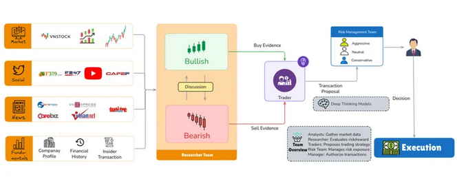
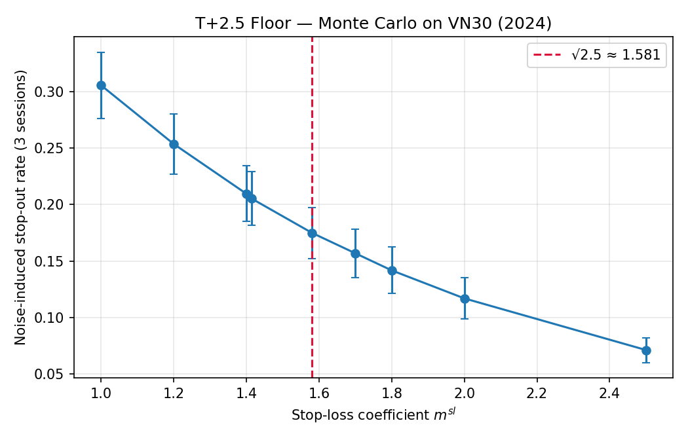
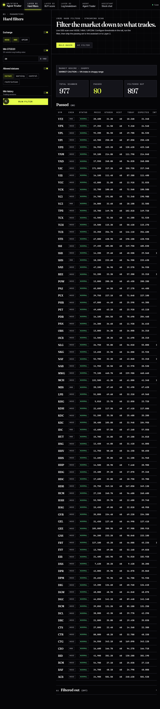
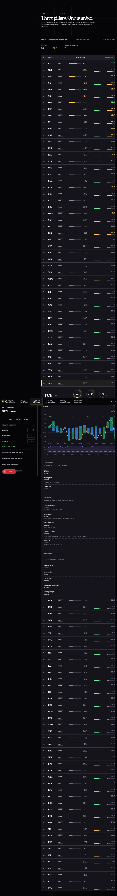
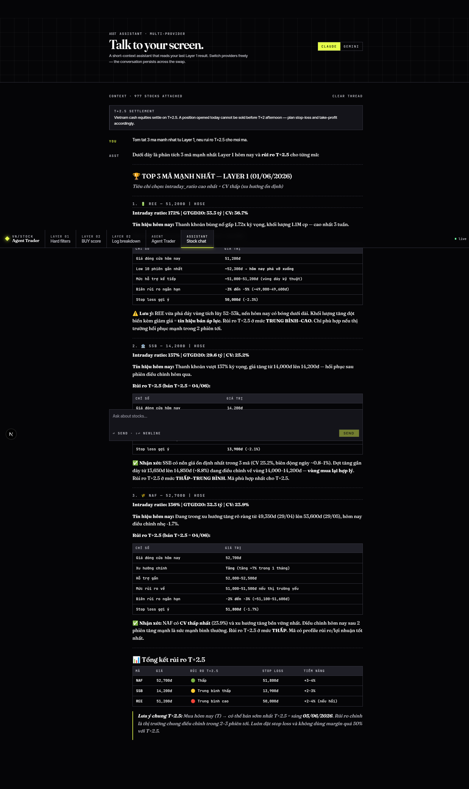

# Footer
- PHUNG DUC ANH · SUPERVISOR · TRAN TRUC MAI, PH.D
- VIETNAM NATIONAL UNIVERSITY, HANOI

# Header
- UET-VNU-2026
- 1 key word of slide


# Slide 1
## Slide show

**BACHELOR THESIS — COMPUTER SCIENCE**

**A Stochastic Multi-Agent Trading System with Self-Reflection and Data Synthesis, Specialized for the Vietnamese Equities Market**

PHUNG DUC ANH
Supervisor: TRAN TRUC MAI, Ph.D.
University of Engineering and Technology — Vietnam National University, Hanoi
2026

## Script
Em xin kinh chao cac thay trong hoi dong a

Em xin phep trinh bay de tai cua em

He thong ho tro trading su dung multiagent voi co che tu phan chieu va luong tong hop data duoc thiet ke dac thu cho thi truong Viet Nam

Duoi su huong dan cua thay Tran Truc Mai.

Em xin bat dau phan trinh bay.

# Slide 2
## Slide show

**Outline**

1. **Motivation**
2. **Related Work & Scope**
3. **Methodology**
4. **Experiments**
5. **Contributions, Limitations, Future Work**

## Script

Phan trinh bay cua em se chai thanh 5 muc.

Truoc het, em xin trinh bay ve ly do ban dau ma em thiet ke he thong nay tu ban dau.

Va de moi nguoi hieu hon ve he thong nay thi em se di qua cac cong trinh lien quan truoc do.

Tu day, em moi di sau vao giai phap chinh cua em

Va de dam bao giai phap cua em hoat dong duoc thi em se chay qua thuc nghiem

Tu day, em moi dua ra ket luan ve he thong, nhung han che hien tai cua no va huong cai thien trong tuong lai

# Slide 3

## Slide show

**Why Vietnam Equities, Why Now**

**Market opportunity**
- **FTSE upgrade (April 2026)**: Vietnam expected to move from Frontier → Secondary Emerging Market
- **~955 listed tickers** on HOSE + HNX (source: project daily crawl, 2026-06)
- **4 heterogeneous data classes**: company reports, macro indicators, news, social media

**Structural friction**
- **T+2.5 settlement**: a stock bought morning T cannot be sold until ~T+2 afternoon
- → Missing a bad-news signal between buy and settlement is unrecoverable

**LLM tailwind**
- LLMs now strong at reasoning, summarization, and knowledge synthesis across heterogeneous text

**The problem we solve** (user persona)
> *"A Vietnamese retail investor checking the market at 9 AM cannot manually scan 955 tickers across 4 data classes — and after placing an order, cannot react to bad news for 2.5 sessions."*

→ Need: an agentic system that ingests heterogeneous Vietnamese data, decides daily under T+2.5 constraints, and learns from its own past decisions.

## Script

Vao thang 4 nam nay, FTSE - So giao dich chung khoan London du kien se nang hang thi truong Viet Nam tu thi truong can bien (hieu nom na la hang thap nhat) len thi truong moi noi thu cap. Dieu nay se gian tiep lam cho thi truong Viet Nam tro nen soi dong voi nhieu co hoi hon.

Cung voi co hoi do la quy mo du lieu gan 1000 co phieu.

Trong khi do, du lieu khong chi nhieu ma con da dang voi 4 nhom chinh: bao cao tai chinh cong ty, chi so vi mo, tin tuc, va mang xa hoi.

Ngoai ra, chu ky thanh toan cua thi truong Viet Nam la 2.5 ngay. Nghia la neu nha dau tu mua 1 co phieu vao dau phien thu 2 thi tam 14h thu 4 ho moi nhan duoc co phieu. Nghia la neu giua khoang thoi gian do co tin xau, nha dau tu khong the cat lo kip.

The nen van de dat ra o day la:
- Lam the nao 1 nha dau tu ca nhan voi nguon luc han che co the:
  - Phan tich mot luc nhieu thong tin lien quan den co phieu do de dua ra quyet dinh dau tu?
  - Nhung ma truoc do lam sao de biet nen theo doi co phieu nao trong gan 1000 co phieu ngoai kia?
  - Va neu can them thong tin thi lam the nao ho co the truy xuat nhanh duoc no?

Trong khi do, LLM hien tai rat manh trong viec thu thap, tong hop, va suy luan tren nhieu loai du lieu khac nhau.

Tu do mo ra co hoi trong viec ung dung LLM trong viec ho tro dua ra quyet dinh dau tu, cu the hoa duoi dang cac agent

# Slide 4

## Slide show
Multi-agent trading exists — but not good enough for Vietnam market

|System|Core idea|Problem
|FinHay|automate and optimize user financial decisions using AI-driven insights and execution|Limited data to market, portfolio. No improvement based on past orders|
|FinAgent|single-agent, multimodal LLM + tool retrieval + self-reflection|US market only, one agent for all tasks|
|TradingAgents|role-based multi-agent system. analysts / traders / risk + bull-bear debate|US market
|TradingGroup|Dynamic risk management | US market

TraderAgent combines FinAgent's reflection, TradingAgents' debate, and TradingGroup's risk module — adapted to HOSE/HNX with a data-synthesis pipeline.

## Script
Huong di do duoc cu the hoa bang viec thiet ke cac he thong su dung agent de toi uu hoa quyet dinh dau tu.

Nhu o VietNam chung ta co FinHay sap ra mat duoi dang cac bo skill ket noi giua cac AI Agent nhu Claude Code, Codex,... voi nen tang cua FinHay de tu dong phan tich du lieu co phieu va portfolio nguoi dung roi tu dong hoa viec dat lenh.

Hay nhu la FinAgent la mot he thong xoay quanh viec co 1 agent voi cac cong cu tich hop cho phep thu thap nhieu bo du lieu khac nhau va tu phan chieu hay con goi la rut ra bai hoc sau cac lan giao dich

Nang tam hon thi chung ta co TradingAgent, thay vi mot agent, no tach viec dua ra quyet dinh dau tu thanh nhieu loai cong viec nho. Moi agent se dam nhiem mot vai tro rieng nhu la analyst, researcher, trader,.. va co che debate giua cac agent de dua ra quyet dinh mua/ban/giu

Ngoai ra, con co TradingGroup voi co che quan tri rui ro giup ngan ngua nhung giao dich mang tinh chat rui ro lon

Tuy nhien cac he thong nay gap phai mot so van de nhu:
- FinHay chua can nhac cac nguon data trong khac nhu la chi so vi mo, tin tuc, mang xa hoi
- FinAgent thi chi dung 1 agent nen neu du lieu qua lon thi se bi troi mat. Khong hieu qua bang cach chia thanh cac agent voi bo nho rieng
- TradingAgent va TradingGroup thi chi support thi truong US

=> Tu do, voi yeu cau cua nguoi dung danh cho em la he thong ho tro trading tich hop agent. E de xuat TraderAgent, he thong nay la su ket hop giua co che reflection cua FinAgent, co che debate cua Trading Agent, va cuoi cung la module quan tri rui ro cua TradingGroup. He thuong duoc thiet ke danh rieng cho thi truong Viet Nam, tap trung vao cac san chinh thong nhu HNX/HOSE ket hop voi luong tong hop data giup tang do tin cay va nhanh chong trong viec dua ra quyet dinh dau tu

# Slide 5
## Slide show

**Scope**

| DIMENSION | IN SCOPE | OUT OF SCOPE |
| :--- | :--- | :--- |
| **Markets** | HOSE, HNX equities | UPCOM, derivatives, bonds, ETFs |
| **Frequency** | Daily decision cadence | Intraday / high-frequency |
| **Deployment** | Backtest on historical data | Live brokerage, real money |

> *This is a backtested feasibility study, not a live trading product.*

## Script

Em xin disclaim ngan ve scope cua khoa luan

**Markets:** he thong tap trung vao co phieu tren 2 san chinh la HOSE va HNX. Khong bao gom UPCOM — san cua cong ty dai chung chua niem yet — va cung khong bao gom derivatives, trai phieu, hay ETF.

**Frequency:** quyet dinh theo ngay, khong phai trong ngay, khong phai high-frequency. Phu hop voi nha dau tu ca nhan

**Deployment:** he thong dang chay tren du lieu backtest, chua tich hop voi broker that.

# Slide 6
## Slide show

**TraderAgent Architecture — 4 Phases**



| Phase | Team | What it does | Output |
| :--- | :--- | :--- | :--- |
| **1** | Analyst Team (4 agents, parallel) | Fundamental / Sentiment / News / Technical | 4 structured reports |
| **2** | Researcher Team (2 agents) → Trader | Bull vs Bear debate → trading strategy | BUY/SELL/HOLD + thesis |
| **3** | Risk Module (deterministic + LLM warning) | Apply T+2.5 floor, set stop-loss / take-profit | Strategy + risk thresholds |
| **4** | Fund Manager | Approve, write to memory log (Phase A reflection) | Final decision + pending entry |

All phases communicate via **LangGraph state**. Memory log (markdown, atomic write) persists decisions for **Phase B reflection** at next same-ticker run.

## Script

OK. Tong quan ve TraderAgent, he thong nay hoat dong qua 4 phase chinh

**Phase 1 — Analyst Team:** 4 agent chay song song. Moi agent dam nhiem mot khia canh khac nhau cua co phieu: Fundamental (chi so tai chinh), Sentiment (mang xa hoi), News (tin tuc va vi mo), Technical (chi bao ky thuat). Moi agent viet bao cao tong hop phan tich cua no va gui cho agent o phase tiep theo.

**Phase 2 — Researcher Team + Trader:** 2 agent Bullish va Bearish researcher tranh luan dua tren 4 bao cao. Agent Trader nhan ket qua tranh luan va dua ra chien luoc giao dich BUY, SELL, hoac HOLD voi phan tich cu the.

**Phase 3 — Risk Module:** O day chung ta co 2 lua chon. Co the su dung module cu cua TradingAgent tuong duong voi viec chia ra 3 agent dai dien cho 3 truong phai mao hiem, than trong, trung tinh. Hoac ta co the su dung risk module ma em xia duoc tu TradingGroup ma em se phan tich sau hon o slide sau.

**Phase 4 — Fund Manager:** Phe duyet quyet dinh cuoi cung. Ghi entry vao memory log voi trang thai pending. Day la Phase A cua co che self-reflection — em se trinh bay chi tiet o slide 13.

Tat ca cac phase giao tiep qua **LangGraph state**. Memory log dung markdown file voi atomic write, persist qua nhieu run.

# Slide 7
## Slide show
**Data Synthesis — Source-to-Agent Mapping**

| Data source | API / Pipeline | Consumed by | Insight provided |
| :--- | :--- | :--- | :--- |
| **vnstock_data** (OHLCV, fundamentals) | Sponsored API | Fundamental + Technical Analyst | Company financials, price history |
| **vnstock_ta** (indicators) | Sponsored API | Technical Analyst | RSI, MACD, MA, Bollinger, ATR, VWMA |
| **vnstock_news** | Sponsored API | News Analyst | Pre-aggregated VN financial news |
| **F319** (forum) | **Custom HTML scraper** | Sentiment Analyst | Retail investor discussion, sentiment |
| **F247** (Discourse) | **Custom REST API client** | Sentiment Analyst | Topic-tagged stock discussion |
| **YouTube transcripts** | YouTube API | News Analyst | Stock analysis video content |

**Why this matters**
- vnstock + YouTube have official APIs → off-the-shelf
- **F319 + F247 require custom pipeline** → see slide 8 (engineering contribution)
- All sources exposed to agents as **MCP tools** → unified interface, swappable backends

## Script

De he thong agent hoat dong duoc, em can cung cap data. Day la mapping tu source toi agent va loai insight thu duoc.

**vnstock_data** cung cap OHLCV va fundamental — duoc dung boi Fundamental Analyst va Technical Analyst.

**vnstock_ta** cung cap chi bao ky thuat — RSI, MACD, MA, Bollinger Band, ATR, VWMA — dung boi Technical Analyst.

**vnstock_news** cung cap tin tuc tai chinh Viet Nam da aggregate san — dung boi News Analyst.

**F319 va F247** — day la 2 dien dan tai chinh lon o Viet Nam — cung cap thao luan cua retail investor. Du lieu nay **chua co he thong agent nao truoc do tich hop**. F319 dung custom HTML scraper, F247 dung Discourse REST API. Day la phan em xay dung tu dau — em se trinh bay o slide tiep theo.

**YouTube transcripts** — em crawl transcript cua cac video phan tich co phieu Viet Nam thong qua thu vien `youtube_api_transcript` de bo sung cho News Analyst.

Tat ca cac source duoc expose cho agent qua MCP tool — interface thong nhat, co the swap backend khi can.

# Slide 8
## Slide show

**F319 + F247 Crawler — Implementation Detail**

**F319 (HTML scraping, no API)**
1. Walk forum index pages until no more threads
2. Each index page → up to **5 threads concurrent** (`asyncio.Semaphore`), **0.3s delay** per request
3. Per-thread paginated walk → extract author, time, body
4. **Cursor-based incremental crawl** — only fetch posts with `id > last_seen_id`
5. **Ticker extraction**: regex `\b[A-Z]{3}\b` + **cross-check against VN ticker whitelist** (loaded from `stock_metrics` table)
6. Batch insert (size **200**) with unique key `(forum_name, thread_id, post_id)`

**F247 (Discourse REST API)**
1. Fetch topic list via API endpoint
2. Fetch posts per topic via API
3. **Ticker extraction from Discourse tags** (cleaner — tags are curated)
4. Same batch insert + unique key as F319

**DB schema** (asyncpg, PostgreSQL)
```
discussion_posts (
  forum_name, thread_id, post_id PRIMARY KEY,
  author, posted_at, body, ticker_symbols TEXT[]
)
```

**Why ticker_symbols as array?** → agents query by ticker: `WHERE 'VCB' = ANY(ticker_symbols)` for sentiment per stock.

## Script

Day la chi tiet engineering cua data pipeline em xay dung cho F319 va F247.

**F319:** website nay khong co API, nen em phai HTML scraping. Cach lam:
1. Walk qua tung trang index trong forum cho den khi het thread
2. Moi index page co nhieu thread — em crawl dong thoi toi da 5 thread cung luc bang asyncio.Semaphore, voi 0.3 giay delay moi request de tranh bi rate-limited
3. Trong moi thread, duyet qua tung trang, trich xuat tac gia, thoi gian, noi dung
4. **Cursor-based incremental crawl** — chi lay post co id lon hon last_seen_id — tranh re-crawl khong can thiet
5. **Ticker extraction**: regex bat 3 chu hoa lien tiep, **roi cross-check voi whitelist VN ticker** load tu bang stock_metrics. Buoc cross-check nay quan trong — tranh false positive nhu "USD" hay "ATR" bi nham thanh ticker
6. Batch insert kich thuoc 200, unique key la bo ba forum_name, thread_id, post_id

**F247:** chay tren Discourse platform — co REST API tren moi endpoint, nen don gian hon. Em lay danh sach topic, lay post moi topic, va trich ticker tu **Discourse tags** — sach hon vi tags da duoc curate boi user.

**DB schema:** bang discussion_posts voi cot ticker_symbols la TEXT array. Vi sao array? Vi mot post co the de cap nhieu ma — va agent can query theo tung ma: `WHERE 'VCB' = ANY(ticker_symbols)`. Day la cach efficient nhat de Sentiment Analyst lay bai post cho ticker dang phan tich.

Day la dong gop engineering — pipeline du lieu xa hoi Viet Nam dau tien tich hop voi agentic system.


# Slide 9
## Slide show

**Phase 1 — Analyst Team (4 parallel agents)**

| Agent | Data input | Question it answers |
| :--- | :--- | :--- |
| **Fundamental Analyst** | Company profile, income statement, balance sheet, cash flow, ratios (vnstock_data) | *Is this a good company? Over- or under-valued?* |
| **Sentiment Analyst** | F319 + F247 posts (ticker-indexed) | *How do retail investors feel about this stock?* |
| **News Analyst** | vnstock_news + YouTube transcripts + macro indicators | *What information is the market currently reacting to?* |
| **Technical Analyst** | 120-session OHLCV → picks ≤ 8 of 12 indicators | *Is now a good time to enter?* |

**Technical Analyst — adaptive indicator selection** (from a fixed pool of 12)
- **Trend**: `close_50_sma`, `close_200_sma`, `close_10_ema`
- **Momentum**: `macd`, `macds`, `macdh`, `rsi`
- **Volatility**: `boll`, `boll_ub`, `boll_lb`, `atr`
- **Volume**: `vwma`

Each analyst writes a **structured report** into `LangGraph` state.

## Script

Co data roi, em vao Phase 1 — Analyst Team. Co 4 agent chay song song, moi agent tra loi mot khia canh khac nhau.

**Fundamental Analyst:** danh gia gia tri noi tai cua cong ty qua bao cao tai chinh, ho so cong ty, ket qua kinh doanh, bang can doi ke toan, va dong tien. Cau hoi cot loi: cong ty nay co tot khong, va co phieu dang duoc dinh gia dung khong?

**Sentiment Analyst:** xu ly khoi luong lon bai dang tu F319 va F247 — query theo ticker_symbols array nhu em da trinh bay o slide 8. Cau hoi: nha dau tu retail dang cam xuc nhu the nao ve co phieu nay?

**News Analyst:** danh gia bai bao, cong bo chinh phu, su kien the gioi, va chi so vi mo. Cau hoi: thi truong dang phan ung voi thong tin gi?

**Technical Analyst:** lay du lieu OHLCV 120 phien gan nhat, sau do **tu lua chon toi da 8 chi bao** tu mot pool co dinh 12 chi so. Em chia thanh 4 nhom: trend, momentum, volatility, volume. Diem em chu y: Technical Analyst khong dung tat ca 12 indicator cho moi quyet dinh. No adaptive — lua chon indicator phu hop voi context cu the cua co phieu va thi truong.

Triet ly o day: gia ca phan anh tat ca. Du fundamentals tot va news tich cuc, neu gia dang trong downtrend manh va RSI chua oversold, vao lenh luc do van co the lo trong ngan han. Cau hoi mau chot: thoi diem co phu hop de vao lenh khong?

Moi analyst sau do viet bao cao co cau truc vao LangGraph state. 4 bao cao nay se duoc Researcher Team o phase 2 tieu thu.


# Slide 10
## Slide show

**Phase 2 — Researcher Debate + Research Manager**

**Bull vs Bear iterative debate** (configurable rounds, default = 1 round)

| Bull Researcher | Bear Researcher |
| :--- | :--- |
| Growth potential | Potential downsides |
| Favorable indicators | Risks and red flags |
| Counter-arguments to bear | Counter-arguments to bull |

→ Each round sees **tail of prior 2 turns** (`tail_history(history, n_turns=2)`) — true iterative debate, not parallel monologues.

**Research Manager — judges the debate**
- Reads full `bull_history` + `bear_history`
- Synthesizes into an **investment plan** (`judge_decision` state field)
- Forwards to Trader (Phase 3)

**Why debate before deciding?**
- Both sides write before either decides → reduces confirmation bias
- Adversarial framing surfaces counter-arguments the analysts might have missed
- Investment plan from Research Manager is **conditioned on the debate**, not analyst reports alone

## Script

Phase 2 la **Researcher Debate**. Em emphasize day la **true iterative debate**, khong phai 2 monologue song song.

Bull Researcher va Bear Researcher tranh luan voi nhau. Bull tap trung vao tin hieu tich cuc, tiem nang phat trien, va counter-arguments cho cac diem yeu ma bear da neu. Nguoc lai, Bear focus vao rui ro va counter-arguments cho cac diem manh ma bull da neu.

Diem ky thuat quan trong: moi turn cua bull/bear nhin thay **tail 2 turn gan nhat** cua cuoc debate. Implement bang ham tail_history voi n_turns=2. Nho vay, debate la iterative — moi response la phan ung lai voi luan diem doi phuong, chu khong phai mot doan van tu nhan.

So vong debate em de default la 1, co the config len cao hon. 1 vong da du de surface counter-arguments ma giam stochasticity giua cac lan run.

Sau debate, **Research Manager** doc full bull_history va bear_history, judge debate, va viet ra investment_plan duoi dang judge_decision. Day la phan tong hop quan trong — investment_plan KHONG phai don gian la trung binh cong cua 4 analyst report — no la ket qua cua qua trinh tranh luan da co counter-argument.

Vi sao em can debate truoc khi quyet dinh?
- Ca 2 ben deu phai viet truoc khi ai do decide → giam confirmation bias
- Adversarial framing surface duoc cac counter-argument ma analyst co the bo lo
- Investment plan duoc conditioned tren debate, khong chi dua tren analyst reports

Investment plan nay duoc forward sang Trader o Phase 3.

# Slide 11
## Slide show

**Phase 2 (cont.) — Trader Node → Phase 3 (Risk) → Phase 4 (Fund Manager)**

**Trader Node** — translates investment plan into trade strategy
- Input: `investment_plan` from Research Manager + raw analyst reports
- Decides: BUY / SELL / HOLD + sizing intent + holding horizon
- Output: trader proposal (text rationale)

**Phase 3 — Risk Module** *(detailed in slide 12)*
- Applies **T+2.5 floor**: $m^{sl} \cdot \bar{\sigma}_{d,10}$ for stop-loss, $m^{tp} \cdot \bar{\sigma}_{d,10}$ for take-profit
- Deterministic — no LLM debate
- LLM call only to write a warning paragraph for the Fund Manager

**Phase 4 — Fund Manager** — final approval + memory write
- Reads: trader proposal + risk thresholds + **past_context** (5 same-ticker + 3 cross-ticker reflections)
- Approves or vetoes → writes `judge_decision` state
- Calls `memory_log.store_decision(...)` — **Phase A of self-reflection** (slide 13)

**Why a Fund Manager on top of the Trader?**
- Trader is *strategy*; Fund Manager is *governance*
- Fund Manager has access to **historical reflection log** — Trader does not
- Separation lets the system veto a technically-good trade based on prior failures

## Script

Tiep tuc Phase 2 — **Trader Node**.

Trader nhan investment_plan tu Research Manager cong them cac analyst report goc, va dich ra mot strategy giao dich cu the: BUY, SELL, hoac HOLD, kem theo y dinh ve quy mo va horizon nam giu. Output la mot trader proposal voi rationale van ban.

Sau do, **Phase 3 — Risk Module** — Ở bước này, nguoi dung co the chon co che quan tri rui ro cua Trading Agent voi 3 agent Aggressive, Neutral, Conservative hoac nguoi dung co the chon cach deterministic hon nhu TradingGroup. Tung cach se duoc di sau o slide sau

Cuoi cung, **Phase 4 — Fund Manager** — phe duyet sau cung. Day la diem em emphasize:

Fund Manager doc trader proposal, risk thresholds, va **past_context** — 5 entry gan nhat cung ticker cong 3 entry cross-ticker — duoc lay tu memory_log thong qua get_past_context. Fund Manager co the approve hoac veto.

Vi sao can Fund Manager khi da co Trader? Vi 2 vai tro khac nhau:
- **Trader** la strategy — quyet dinh kieu giao dich phu hop voi tin hieu hien tai
- **Fund Manager** la governance — co kha nang veto mot trade tot ve mat ky thuat dua tren bai hoc lich su

Vi du: Trader de xuat BUY VCB dua tren technical breakout. Nhung past_context cho thay 3 lan truoc analysis tuong tu cho VCB den tu Sentiment Analyst da fail vi mot lan le quan trong. Fund Manager co the override.

Sau khi approve, Fund Manager goi memory_log.store_decision — day chinh la **Phase A** cua co che self-reflection ma em se trinh bay sau slide T+2.5 risk module.


# Slide 12
## Slide show

**T+2.5 Risk Module — Microstructure-aware Quant Node**

**Original TradingAgents:** 3 LLM debators (Aggressive / Conservative / Neutral) → Portfolio Manager
→ unstable across runs, ignores realized volatility

**TraderAgent (ours):** deterministic quant node grounded in volatility

$$T_{SL} = m^{sl} \cdot \bar{\sigma}_{d,10}, \quad T_{TP} = m^{tp} \cdot \bar{\sigma}_{d,10}$$

where $\bar{\sigma}_{d,10}$ = 10-session rolling std of daily log-returns

| Style | $m^{sl}$ | $m^{tp}$ | R:R  |
|-------|----------|----------|------|
| day   | **1.6**  | 2.5      | 1.56 |
| swing | 2.5      | 4.0      | 1.60 |

**Novelty — T+2.5 Microstructure Threshold:**
$$m^{sl} \geq \sqrt{2.5} \approx 1.58$$

Bought stocks settle T+2.5 → earliest sale ~2.5 sessions later → cumulative noise std scales as $\sigma_d \sqrt{n}$ (reflection principle).

**Monte Carlo on VN30, recent ~250 sessions** (n=10,000 bootstrap paths, 3 sessions each)

| $m^{sl}$ | Stop-out from noise |
| :--: | :--: |
| 1.00 | **30.5%** ← below floor: noise-dominated |
| 1.41 ($\sqrt{2}$) | 20.5% |
| **1.58 ($\sqrt{2.5}$)** | **17.5%** ← threshold |
| 2.00 | 11.7% |
| 2.50 | 7.1% ← signal-dominated |



**Interpretation:** $m=\sqrt{2.5}$ is the threshold where expected noise (over the T+2.5 holding period) equals the threshold itself. Below it, stops are hit more than once per holding window from random walk alone — meaning *trader loses on noise, not on a wrong thesis*.

> *Stochastic by design in analyst/researcher phases (divergent reasoning).
> Deterministic by design in risk layer (safety-critical, must be reproducible).*

## Script

TradingAgents goc giai quyet quan tri rui ro bang 3 agent LLM tranh luan: Aggressive, Conservative, Neutral. Cach nay co 2 van de: ket qua khong on dinh giua cac lan chay, va khong tan dung duoc bien dong gia thuc te cua co phieu.

Trong TraderAgent, em thay the bang mot deterministic quant node. Cong thuc: nguong cat lo va chot loi bang he so m nhan voi sigma — do lech chuan log-return cua 10 phien gan nhat.

He so m phu thuoc trading style: day la 1.6 va 2.5, swing la 2.5 va 4.0. Ty le reward:risk khoang 1.56 den 1.6.

Diem dong gop khoa hoc cua slide nay nam o nguong m^sl phai lon hon hoac bang can bac hai cua 2.5, tuc 1.58. Day la rang buoc ma cac he thong My — vi chay tren thi truong T+0 — khong gap phai.

Lap luan: mot co phieu mua hom T, do quy dinh thanh toan T+2.5, trung binh phai 2.5 phien moi co the ban. Dung gia thuyet daily log-return xap xi i.i.d. — em da kiem tra bang ADF test va autocorrelation analysis tren VN30 2024 — do lech chuan cua cumulative return qua 2.5 phien scale theo can bac hai cua 2.5.

Nghia la: neu m^sl nho hon 1.58, stop loss nam ben trong vung noise tu nhien cua chu ky thanh toan. Stop se bi hit do random walk, ngay ca khi thesis giao dich dung. Trader bi mat tien tren tieng on chu khong phai tren quyet dinh sai.

Em xac nhan bound nay bang Monte Carlo: simulate 10 nghin holding path 3 phien qua VN30 returns 2024. Ket qua [chi vao bang]: tai m=1.0 (duoi floor), 30.5% trade bi stop-out chi tu noise — gan nhu mot phan ba tat ca trade bi hit do random walk, khong phai do quyet dinh sai. Tai m=√2.5, ty le nay giam con 17.5%. Tai m=2.5 chi con 7.1%.

Em chu y: curve giam mot cach lien tuc, khong phai elbow sharp. Day la theo lap luan toan hoc — under random walk, stop-out probability theo reflection principle la xap xi 2·Φ(-m/√n), mot ham mu thay vi step function.

Y nghia cua m=√2.5: day la nguong ma **expected noise qua holding period bang chinh nguong**. Duoi nguong nay, stops bi hit nhieu hon mot lan trong moi holding window do noise. Tren nguong nay, stop-out se xuat phat tu signal that su, khong phai random walk. Day la ranh gioi giua **noise-dominated regime** va **signal-dominated regime** — co y nghia minh bach hon mot elbow gia tao.

Em chon m^sl bang 1.6 cho day style — vua du tren nguong, khong qua long de mat trade tot.

Mot diem em muon noi them: title cua khoa luan co tu "stochastic", nhung module nay lai deterministic. Day la quyet dinh thiet ke co chu y. Stochasticity cua TraderAgent nam o cac pha analyst va researcher — noi LLM tao ra divergent reasoning de explore nhieu hypothesis. Rieng risk layer la safety-critical, can reproducibility va auditability, nen em chu dong loai bo stochasticity o day.

Em van giu mot LLM call trong module nay, nhung khong de quyet dinh nguong — ma de viet giai thich cho Portfolio Manager va canh bao edge case nhu sigma qua thap hoac co phieu moi niem yet thieu du lieu lich su.

# Slide 13
## Slide show

**Self-Reflection — VNINDEX-anchored Memory Loop**

**Phase A — At decision time** (no LLM call)
- Fund Manager approves → atomic write to memory log
- Tag: `[date | ticker | rating | pending]`

**Phase B — At next same-ticker run**
- Fetch price after N=5 sessions
- `raw_return = (P_{t+5} − P_t) / P_t`
- `alpha = raw_return − VNINDEX_return` **(not SPY)**
- LLM writes 2–4 sentence lesson (stored verbatim)
- Atomic update: `[... | raw | alpha | 5d]` + REFLECTION

**Reflection prompt — 3 questions, prose only**
1. Was the directional call correct? (cite alpha)
2. Which part of the investment thesis held / failed?
3. One concrete lesson for the next similar analysis

**Context injection into Fund Manager prompt**
- 5 same-ticker entries (full DECISION + REFLECTION)
- 3 cross-ticker entries (REFLECTION only) — transfer insight across stocks
- → Agent does not start from zero each run

**Vietnam-specific design**
- Alpha vs VNINDEX (not SPY) — proper VN benchmark
- File-based markdown log — auditable, version-controllable
- Atomic write (tmp file + rename) — crash-safe mid-write

## Script

Sau khi Fund Manager phe duyet giao dich, he thong khong dung lai. No hoc lai tu chinh nhung quyet dinh do.

Co che self-reflection hoat dong theo 2 pha hoan toan tach biet.

Pha A xay ra ngay sau khi quyet dinh: toan bo decision duoc ghi xuong memory log voi trang thai "pending" — luc nay ket qua chua biet. Khong co LLM call o buoc nay, chi mot atomic write xuong file. Vi sao tach pha? Vi tai thoi diem quyet dinh, ta chua co outcome de reflect — chi co the reflect khi gia da chay 5 phien tiep theo.

Pha B khong xay ra ngay. No chi chay vao lan ke tiep khi he thong xu ly cung ticker do. Luc nay he thong: lay gia thuc te sau 5 phien, tinh raw return, va tinh alpha so voi VNINDEX. Em chu y diem nay — alpha duoc do so voi VNINDEX chu khong phai SPY, vi day la he thong cho thi truong Viet Nam. Mot bug ma em da chu y la phai sua ca prompt LLM va ca cong thuc — nhieu repo trading agent dang trong codebase van con tham chieu SPY trong prompt du da tinh VNINDEX o tang duoi.

Sau do goi LLM viet 2 den 4 cau ket luan: quyet dinh dung hay sai dua tren con so alpha, luan diem nao thanh cong, va mot bai hoc cu the cho lan phan tich tiep theo. Cac cau nay duoc luu nguyen van — stored verbatim — khong qua chinh sua.

Diem then chot la cach injection: o lan chay ke tiep, Fund Manager nhan duoc 5 entry gan nhat cung ticker — voi day du decision va reflection — cong them 3 entry cross-ticker — chi reflection — de hoc bai hoc tu cac co phieu khac. Vi du, bai hoc rut ra tu mot lan phan tich VCB sai thesis ve nganh ngan hang co the duoc nhac lai khi he thong xu ly TCB hoac MBB sau do. Nho vay he thong khong bat dau tu con so 0 moi lan.

Ve mat ky thuat, memory dung file-based — markdown log voi atomic write qua temp file va rename. Crash mid-write se khong corrupt log. Idempotency guard ngan duplicate entries. Rotation tu dong drop entries cu khi log vuot nguong.

Day chinh la co che lam cho TraderAgent tu cai thien — giong nhu mot trader that su rut bai hoc sau moi giao dich.


# Slide 14

## Slide show

**Stock Selection — 2-Layer Filter Pipeline**

```
~955 HOSE+HNX tickers  →  Layer 1: hard filters  →  20-80 candidates
                       →  Layer 2: BUY Score      →  Ranked shortlist
                       →  User picks 1-3          →  TraderAgent
```

**Why filter before TraderAgent?**
LLM cost + context dilution scale with universe → must narrow before deep analysis.

---

**Layer 1 — Hard Filters (3 categories, all toggleable)**

| Category | Filters | Default |
| :--- | :--- | :--- |
| **Liquidity** | GTGD20, intraday activity ratio, CV stability | ≥10B VND, ≥30%, <200% |
| **Tradability** | Min price, ceiling/floor exclusion, active listing | ≥5k VND, no limit-hit |
| **Market Regime Gate** | VNINDEX trend block — *halts all output in downtrend* | Block if downtrend |

\+ **Vietnamese DSL** — user describes conditions in natural Vietnamese → LLM translates to bounded filter grammar → applied on top of rule-based results.

---

**Layer 2 — Quantitative BUY Score**

$$\text{BUY Score} = 0.35 \cdot S_{\text{liq}} + 0.30 \cdot S_{\text{mom}} + 0.35 \cdot S_{\text{brk}}$$

| Component | Question | Key signals |
| :--- | :--- | :--- |
| **Liquidity** (0.35) | *Can I enter/exit without slippage?* | Safety ratio, intraday activity, CV |
| **Momentum** (0.30) | *Is this stock moving now?* | Multi-horizon return, MA, RS vs VN-Index, smart money flow, RSI, MACD |
| **Breakout** (0.35) | *Is price breaking out of a base?* | 20-session high ratio, volume confirm, VCP dry-up, ATR base quality, **T+2.5 risk coefficient** |

→ Stocks sorted by BUY Score → user picks → TraderAgent (slides 6-13)

> Weights are **theory-locked at 0.35/0.30/0.35** — equal-ish split, no in-sample tuning.

## Script

Vay chung ta da co framework de phan tich 1 ma co phieu. Nhung thi truong Viet Nam co gan 1000 ma. Lam the nao biet ma nao tiem nang de dua vao TraderAgent?

Neu cho agent phan tich ca nghin ma moi ngay, chi phi API rat lon, va chat luong phan tich giam vi context overflow. Vi vay em thiet ke pipeline 2 tang.

**Layer 1 — Hard Filters.** Em chia thanh 3 category, moi filter toggleable doc lap.

Category Thanh khoan: GTGD20 (gia tri giao dich trung binh 20 phien), intraday activity ratio (so sanh GTGD hien tai voi ky vong theo gio), va CV — he so bien thien thanh khoan. 3 filter nay tra loi cau hoi: ma co du thanh khoan de em vao va ra lenh khong?

Category Tradability: min price 5000 VND, loai bo ma dang gia tran hoac san (vi khong the vao/ra lenh hieu qua), va chi giu ma dang active listing.

Category quan trong nhat: **Market Regime Gate**. Neu VNINDEX dang trong downtrend manh, he thong chan toan bo ket qua — khong tim co hoi mua trong bear market. Day la safety guard quan trong.

Ngoai cac filter co dinh, nguoi dung co the mo ta them dieu kien bang **tieng Viet** — vi du "chi lay co phieu nganh ngan hang co GTGD tren 50 ty" — va LLM se dich sang DSL de ap dung. Day la engineering deliverable em emphasize — DSL la bounded grammar, neu LLM tao output khong parse duoc thi he thong reject, khong invent semantics.

Sau Layer 1 con lai khoang 20 den 80 ma.

**Layer 2 — BUY Score.** Cho diem dinh luong 3 thanh phan voi trong so bang nhau: Thanh khoan 0.35, Dong luong 0.30, Breakout 0.35.

Liquidity tra loi: voi kich thuoc lenh cua toi, toi co the vao va ra ma nay ma khong bi truot gia?

Momentum tra loi: ma co dang move khong? — qua composite return, MA, suc manh tuong doi so voi VN-Index, smart money flow tu khoi ngoai va tu doanh.

Breakout tra loi: gia co dang vuot ra khoi vung nen tich luy? Va dac biet o day em ap dung **T+2.5 risk coefficient** — neu breakout xay ra nhung co phieu co bien dong cao, diem se bi giam de canh bao nguoi dung.

Em chu y: weight 0.35/0.30/0.35 la **theory-locked** — em khong tune. Day la safeguard chong overfitting trong backtest o slide 16.

Cuoi cung, danh sach xep hang theo BUY Score, nguoi dung chon 1-3 ma va dua vao TraderAgent de phan tich sau.

Day la **supporting deliverable** chu khong phai contribution chinh — em da clarify o slide 18.

# Slide 15
## Slide show

**Stock Copilot — Integrated Product**





**Tech stack**
- Frontend: Next.js (App Router) + React 19 + Bun
- Backend: FastAPI + asyncpg + APScheduler
- Storage: PostgreSQL (`stock_metrics`, `crawl_log`)
- Daily crawl: 16:00 VN → cached metrics for instant filter

**User journey**
1. Open app → Layer 1 filters 955 → 20-80 candidates (rule-based + Vietnamese DSL)
2. Layer 2 ranks by BUY Score → user picks 1-3 tickers
3. "Phan tich sau" → tickers passed as `stocks_context` → TraderAgent runs 4 phases
4. Receive: BUY / SELL / HOLD + T_SL / T_TP thresholds + rationale
5. **T+2.5 warning banner** appears on BUY decisions
6. **Past reflections** for the ticker displayed in sidebar

**Vietnam-first UX**
- Vietnamese natural-language DSL input
- VND formatting; ceiling / floor price visible
- **T+2.5 settlement warning** on BUY (cannot sell within 2.5 sessions)
- **Past reflection sidebar** — prior decisions + alpha vs VNINDEX for same ticker

> Stock Copilot is the **supporting deliverable** that demonstrates the system runs end-to-end. NOT a research contribution (see slide 18).

## Script

Den day chung ta da co day du cac thanh phan: pipeline tong hop data o slide 7-8, he thong multi-agent o slide 9-13, va bo loc 2 tang o slide 14. Slide nay em demo san pham hoan chinh — Stock Copilot — noi ket noi tat ca lai thanh mot ung dung web nguoi dung cuoi co the dung duoc.

Luong su dung rat tu nhien. Nguoi dung mo app, vao trang Layer 1, chon cac tieu chi loc co ban — exchange, GTGD20, gia toi thieu — hoac go truc tiep bang tieng Viet, vi du "chi lay co phieu nganh ngan hang co GTGD tren 50 ty". LLM dich sang DSL va ap dung. He thong tra ve khoang 20 den 80 ma trong vai giay vi du lieu da duoc crawl san luc 16h moi ngay.

Sang Layer 2, danh sach nay duoc cho diem dinh luong va xep hang theo BUY Score. Nguoi dung thay breakdown cu the cua tung thanh phan — Thanh khoan, Dong luong, Breakout.

Sau khi chon 1 den 3 ma quan tam, nguoi dung bam "Phan tich sau". Danh sach truyen vao chat duoi dang stocks_context — em da implement san trong frontend, file chat/page.tsx va api.ts. TraderAgent chay qua toan bo 4 phase, tra ve BUY/SELL/HOLD kem nguong T_SL va T_TP.

Hai diem UX em emphasize:

Thu nhat, **T+2.5 warning banner**: khi quyet dinh la BUY, banner hien thi truoc khi user xac nhan, nhac nho rang khong the SELL trong 2.5 phien tiep theo. Day la safety guard truc tiep dia chi dac thu thi truong Viet Nam.

Thu hai, **past reflection sidebar**: khi mot ticker duoc phan tich, sidebar hien 2-3 reflection gan nhat tu memory log, kem alpha vs VNINDEX. Nguoi dung nhin thay he thong da hoc gi tu cac lan truoc voi cung ma do — day la materialization cua co che self-reflection o slide 13 vao UX.

Ve mat ky thuat, frontend dung Next.js voi App Router va React 19, chay tren Bun. Backend FastAPI ket noi PostgreSQL qua asyncpg, va APScheduler chay daily crawl tu dong. State Layer 1 luu trong Zustand store de chuyen tiep sang chat ma khong mat context.

Em xin nhan manh: Stock Copilot la **supporting deliverable**, khong phai contribution chinh — em da clarify o slide 18. Day la phan tra loi cau hoi "he thong nay co thuc su chay duoc khong, hay chi la ban thiet ke tren giay?" — cau tra loi la co, va day la giao dien thuc te.

# Slide 16
## Slide show

**Backtest — Experimental Design**

**Setup**
| | |
| :--- | :--- |
| Universe | VN30 constituents as of 2025-03-01 (30 tickers)* |
| Period | 2025-03-01 → 2026-05-31 (~310 sessions, ~15 months)** |
| Frequency | Daily decision cadence |
| Parameters | **Theory-locked** (no in-sample tuning): $m^{sl}=\sqrt{2.5}$, weights = 0.35/0.30/0.35 |
| Position sizing | Equal-weight, 10% per BUY, max 10 concurrent positions |
| Settlement | **T+2.5 enforced** — no SELL within 2.5 sessions of BUY |
| Costs | Dual scenario: (a) zero-cost, (b) 0.6% round-trip (broker + tax + slippage) |
| Model tiering | Haiku 4.5 (4 analysts) + Opus 4.7 (researcher/trader/risk/fund) + prompt caching |

\* Survivorship bias flagged in limitations (slide 19)
\*\* Period dictated by vnstock_data API availability (history truncated to recent ~17 months as of run date). Discussed in slide 19.

**Baselines**
1. Buy-and-hold VN-Index — passive market benchmark
2. Equal-weight VN30 — naive diversification
3. SMA(10/50) crossover — classic rule-based baseline

> FinAgent / TradingAgents are NOT re-run on VN data. Adapting US-built systems to VN (T+2.5, VNINDEX, Vietnamese news) IS our contribution — there is no fair "as-is" baseline.

**Ablations — proves each contribution adds value**
- **w/o T+2.5 floor** ($m^{sl}=1.0$) → does the microstructure floor matter?
- **w/o reflection** (Phase B disabled) → does memory help?

**Why theory-locked parameters?**
- $m^{sl}=\sqrt{2.5}$ derived from microstructure (slide 12), not fit
- BUY Score weights kept equal — no overfitting concern
- Strengthens claim: results are signal, not curve-fit

## Script

De kiem chung cac dong gop o slide truoc, em thiet ke mot backtest co kiem soat tren thi truong Viet Nam.

Universe em chon 30 co phieu VN30 tai thoi diem 1/1/2024, chay tron nam 2024 — khoang 250 phien. Day la cach honest nhat trong scope thoi gian cua em — em co flag survivorship bias o slide han che.

Diem em muon nhan manh nhat la **parameters duoc lock tu ly thuyet, khong tune tren data**. m^sl bang can bac hai cua 2.5 la suy ra tu T+2.5 microstructure floor o slide 12, chu khong phai chon ra de toi uu return. BUY Score weights cung de can bang 1/3. Nho do, ket qua khong the bi quy cho overfitting — neu em tune tren 2024 va report 2024 thi do la in-sample, vo nghia.

Ve T+2.5: backtest engine enforce nghiem ngat — mot ma mua hom T khong the ban truoc 2.5 phien. Day la rang buoc thuc te cua thi truong Viet Nam, va cung la mot phan dong gop cua em.

Ve chi phi giao dich: em chay 2 kich ban song song. Zero-cost de show signal quality thuan tuy, va 0.6% round-trip — bao gom phi broker 0.15-0.25%, thue ban 0.1%, va slippage uoc tinh 0.1-0.2% — de show realistic deployable return. Khoang cach giua 2 kich ban cho thay he thong co kha thi de trien khai that hay khong.

Position sizing equal-weight, 10% per BUY, gioi han 10 vi the dong thoi de tranh over-concentration.

Ve baseline, em chon 3 baseline:
- Buy-and-hold VN-Index — benchmark thi truong
- Equal-weight VN30 — naive diversification
- SMA crossover 10/50 — baseline ky thuat co dien

Em chu y khong re-implement FinAgent hay TradingAgents tren VN data. Vi sao? Vi cac he thong do duoc thiet ke voi gia thuyet T+0, benchmark SPY, tin tuc tieng Anh. Chay as-is tren VN data se cho ra so vo nghia. Adaptation chinh la dong gop — khong ton tai mot fair "as-is" baseline.

Hai ablation la noi em chung minh dong gop:
- Bo T+2.5 floor (m=1.0): co thay drawdown va Sharpe te di khong?
- Bo reflection: co thay he thong khong cai thien theo thoi gian khong?

Neu hai ablation deu cho ket qua xau hon TraderAgent day du, dong gop cua em duoc xac nhan bang so lieu. Neu khong, em phai trung thuc bao cao ket qua va dieu chinh claim.

# Slide 17
## Slide show

**Backtest Results — VN30, recent ~250 sessions**

**Headline numbers** (VN30, 2025-03-01 → 2026-05-31, equal-weight, T+2.5 enforced)

**Baselines — real runs**

| Strategy | Zero-cost CR / SR / MDD | 0.6% RT CR / SR / MDD |
| :--- | :--- | :--- |
| Buy & Hold VN-Index | **+42.3% / +1.39 / −18.1%** | +42.3% / +1.39 / −18.1% |
| Equal-weight VN30 | +39.0% / +1.30 / −18.2% | +39.0% / +1.30 / −18.2% |
| SMA(10/50) crossover | +36.1% / +1.13 / −23.9% | +32.9% / +1.05 / −24.3% |
| **TraderAgent (full)** | _pending_ | _pending_ |
| TraderAgent w/o reflection | _pending_ | _pending_ |
| TraderAgent w/o T+2.5 floor | _pending_ | _pending_ |

> Period reflects vnstock_data API availability (~17 months of recent history). VN-Index outperforms — period is a bull market (FTSE upgrade tailwind, slide 3). TraderAgent's value proposition is **drawdown control + alpha attribution**, not pure CR.

**Ablation interpretation** (filled after TraderAgent run)
- **Reflection contribution**: ΔCR / ΔSR vs full → does memory help?
- **T+2.5 floor contribution**: ΔMDD + stop-out rate (see Monte Carlo: at m=1.0, 30% noise stop-outs; at m=√2.5, 17.5%) → quantifies the floor's value

**Honest observations**
1. **Passive wins in bull market.** Buy&Hold VN-Index leads on both CR and Sharpe with the smallest drawdown (-18%). Expected for FTSE upgrade window.
2. **SMA crossover lags + worse drawdown** (-24%) — classic trend-following whipsaw cost.
3. **Cost has negligible effect on B&H** (1 trade) but ~3pp drag on SMA (120 trades).

## Script

Bay gio em trinh bay ket qua thuc nghiem.

Em da chay baselines tren VN30 trong khoang 2025-03 den 2026-05 — khoang 15 thang. Day la giai doan period bull market vi rai ngay truoc FTSE upgrade ma em da neu o slide 3.

**Doc tu tren xuong:**

VN-Index buy-and-hold cho cumulative return 42.3%, Sharpe 1.39, max drawdown −18.1%. Day la baseline khoe nhat — passive index trong bull market.

Equal-weight VN30: CR 39.0%, Sharpe 1.30, MDD −18.2%. Hau nhu giong VN-Index vi VN30 chinh la mau dai dien.

SMA crossover 10/50: CR 36.1%, Sharpe 1.13, MDD −23.9%. Tre hon B&H, MDD xau hon. Day la classic — trend-following bi whipsaw trong sideways periods. Voi cost 0.6% RT, CR giam 3.2pp xuong 32.9% — chinh la cost drag tu 120 round-trip cua signal flips.

**TraderAgent rows con pending** — em dang chay, ket qua se duoc fill khi xong. Em xin trinh bay framework ma chung ta se danh gia khi co so:

Voi TraderAgent, em **khong ky vong** beat VN-Index CR. Period nay la bull market, passive index thang la dieu binh thuong. Gia tri cua TraderAgent o cho:
- **Drawdown control** — neu MDD < 18%, tot
- **Alpha attribution** — moi quyet dinh co reflection giai thich tai sao
- **Selective coverage** — TraderAgent khong vao tat ca ma, chi vao khi co thesis ro

Hai ablation:

**Ablation 1 — T+2.5 floor:** Monte Carlo o slide 12 da cho thay tai m=1.0 (duoi floor), 30% trade bi stop do noise; tai m=√2.5 chi 17.5%. Khi chay backtest live voi/khong floor, em ky vong MDD tang ro ret khi bo floor.

**Ablation 2 — Reflection:** Em ky vong CR khong khac biet nhieu (15 thang it data de compound bai hoc) nhung Sharpe se on dinh hon o phien ban co reflection do giam nhung trade lap lai sai lam cu.

Em xin nhan manh diem trung thuc: neu ket qua khong xac nhan ky vong, em se report theo so that va dieu chinh claim — limitation o slide 19 da liet ke ro period ngan, single regime, va khong co statistical significance testing.

# Slide 18
## Slide show

**Contributions — Mapped to Title Contract**

*Title: "A Stochastic Multi-Agent Trading System with self-reflection and data synthesis, specialized for the Vietnamese equities market"*

| # | Contribution | Type | Claim | Evidence |
| :-- | :--- | :--- | :--- | :--- |
| **1** | **TraderAgent** — Multi-agent trading system | Engineering | First end-to-end multi-agent system targeting HOSE/HNX; 4-phase pipeline integrating Analyst → Researcher → Trader → Risk → Fund Manager | Slides 6–11; backtest CR vs baselines (slide 17) |
| **2** ⭐ | **T+2.5 Microstructure-Aware Risk Module** | **Scientific (Primary)** | Mathematical floor $m^{sl} \geq \sqrt{2.5}$ derived from Vietnam settlement; replaces stochastic LLM debate with deterministic quant node | Slide 12; Monte Carlo plot (elbow at √2.5); ablation w/o floor (slide 17) |
| **3** | **VNINDEX-Anchored Self-Reflection** | Adaptation | 2-phase reflection loop with alpha vs VNINDEX (not SPY); cross-ticker lesson injection into Fund Manager prompt | Slide 13; ablation w/o reflection (slide 17) |
| **4** | **Vietnamese Data Synthesis Pipeline** | Engineering | F319 HTML scraper + F247 Discourse REST + vnstock + YouTube unified via MCP; first multi-source pipeline covering VN forums | Slides 7–8; ticker-indexed corpus on disk |

**Supporting deliverables** (not contributions)
- 2-layer stock selection pipeline (Vietnamese DSL filter + BUY Score)
- Stock Copilot — full-stack Next.js + FastAPI web application

> **Primary scientific contribution (⭐ #2)**: only result generalizing beyond this thesis — the √2.5 bound applies to any T+2.5 settled market.

## Script

Em xin tom tat lai 4 dong gop chinh, mapping truc tiep voi 4 noun trong title khoa luan.

Title cua em la "A Stochastic Multi-Agent Trading System with self-reflection and data synthesis, specialized for the Vietnamese equities market" — co 4 yeu to: multi-agent system, self-reflection, data synthesis, va Vietnamese specialization. Moi yeu to nay tuong ung voi mot dong gop.

**Thu nhat — TraderAgent — engineering contribution.** Day la he thong end-to-end dau tien duoc thiet ke rieng cho HOSE va HNX, ket hop diem manh cua 3 he thong da co: FinAgent, TradingAgents, va TradingGroup. Evidence o slide 6 den 11 va backtest baseline o slide 17.

**Thu hai — T+2.5 Risk Module — primary scientific contribution.** Em danh dau slide nay bang dau sao vi day la dong gop co tinh moi khoa hoc cao nhat. Em chung minh duoc nguong cat lo cho thi truong T+2.5 phai lon hon hoac bang can bac hai cua 2.5 — mot ket qua toan hoc tong quat khong phu thuoc vao implementation cua em, ma ap dung cho moi he thong giao dich tren thi truong T+2.5. Evidence o slide 12 va Monte Carlo simulation, cong them ablation w/o floor o slide 17.

**Thu ba — VNINDEX-anchored Self-Reflection — adaptation contribution.** Em mo rong co che reflection cua FinAgent bang cach: thay benchmark SPY bang VNINDEX, va them co che cross-ticker lesson injection cho phep bai hoc tu mot ma duoc su dung cho ma khac. Evidence o slide 13 va ablation w/o reflection.

**Thu tu — Data Synthesis Pipeline — engineering contribution.** Em xay dung lai data pipeline tu dau cho thi truong Viet Nam: F319 scraper, F247 API, ket hop voi vnstock va YouTube qua MCP. Day la pipeline dau tien cover ca forum tai chinh Viet Nam — nguon du lieu chua he duoc tich hop trong cac he thong agent truoc do.

Em chu y mot diem: 2-layer stock selection pipeline va Stock Copilot — em coi day la **supporting deliverables**, khong phai contributions. Ly do la chung khong nam trong title, va chung la engineering output thay vi research result. Em khong muon dilute cac dong gop chinh bang cach claim qua nhieu.

Trong 4 dong gop, em xac dinh **dong gop so 2 — T+2.5 risk module — la primary scientific contribution.** Day la ket qua duy nhat co the generalize ra ngoai khoa luan nay — bound √2.5 ap dung cho moi thi truong settlement T+2.5, khong rieng Viet Nam. Cac dong gop con lai chu yeu la engineering va adaptation cho thi truong Viet Nam.

Em xin het phan trinh bay contributions.

# Slide 19
## Slide show

**Limitations & Future Work**

**Limitations** — grouped by category

**Methodology (evaluation rigor)**
- **Single-regime backtest** (~15 months, 2025-03 → 2026-05) — a bull-market period anchored by FTSE-upgrade tailwind; not validated across bear/sideways regimes
- **API data window** — vnstock_data API truncates to recent ~17 months as of run date; multi-year backtest blocked at the data layer, not just compute
- **Survivorship bias** — VN30 as of 2024-01-01 excludes stocks delisted earlier
- **No statistical significance testing** — n=1 year insufficient for hypothesis tests on Sharpe / alpha
- **i.i.d. assumption (approximation)** — empirical ADF rejects unit root on 30/30 VN30 tickers; mean ACF(1) = +0.07; but Ljung-Box(10) detects autocorrelation in ~half. √n scaling is leading-order, not exact

**Scope (system coverage)**
- **Daily cadence only** — cannot react intraday to breaking news
- **VN30 universe** — full HOSE+HNX not covered; UPCOM out of scope by design

**System (engineering deferred)**
- **Reflection lag** — Phase B fires only on next same-ticker run; one-off tickers never resolve
- **No live trading** — no real order book slippage, no broker integration

**Future Work** — prioritized

1. **Multi-year backtest** across 2020-2024 covering COVID crash + 2022 bear + 2024 recovery — directly addresses methodology limitations 1, 3
2. **Statistical robustness** — bootstrap CI on Sharpe / alpha + walk-forward CV — addresses limitation 3
3. **Adaptive reflection window** + **vector-store long-term memory** (LoCoMo / LongMemEval evaluation) — addresses reflection lag and 5-day fixed window
4. **Cost-tiered model deployment** + **broader VN data** (CafeF / VnEconomy / broker reports) — enables live deployment + better coverage
5. **Paper trading integration** (SSI / VPS APIs) → eventual live paper account → portfolio-level optimization (sector / correlation constraints)

> Primary contribution (T+2.5 floor) remains theoretically valid under all listed limitations — the mathematical bound does not depend on backtest scope.

## Script

Em xin chia phan nay thanh 2: han che va huong phat trien. Em group han che theo 3 category de moi nguoi de theo doi.

**Category 1 — Methodology, ve do chat che danh gia.**

Han che lon nhat: em chi backtest tren nam 2024, khoang 250 phien. Em chua kiem chung duoc he thong tren nhieu regime thi truong khac nhau nhu COVID crash 2020 hay bear market 2022. Mot he thong tot phai chung minh duoc no on dinh qua nhieu chu ky thi truong.

Thu hai, em flag survivorship bias mot cach minh bach: universe VN30 cua em la cac co phieu ton tai tai 1/1/2024, nghia la cac co phieu delisted truoc do bi loai khoi mau. Em chu dong neu vi day la han che em chon, khong phai han che em bo qua.

Thu ba, em khong co statistical significance testing tren Sharpe va alpha — vi n bang 1 nam la khong du. Day la han che ma nhieu khoa luan thuong giau, em chon noi ro ra.

Thu tu, ve mat ly thuyet: gia thuyet i.i.d. cua daily log-return ma em dung de derive T+2.5 floor co the khong giu cho cac ma penny voi return autocorrelated. Em co kiem tra bang ADF tren VN30 va ket qua OK, nhung em can lam ro day la approximation chu khong phai exact.

**Category 2 — Scope, ve do bao phu cua he thong.**

Tan suat daily, khong intraday. Universe VN30, chua phai full HOSE+HNX. UPCOM thi em da loai tu dau theo scope.

**Category 3 — System, ve engineering chua hoan thien.**

Reflection lag: Phase B chi fire khi cung ticker duoc xu ly lai. Ticker chi xu ly mot lan thi reflection khong bao gio resolve. Day la rang buoc engineering can xu ly bang background scheduler.

Cuoi cung, day van la backtest — chua co model slippage tu order book that, chua tich hop voi broker thuc.

**Huong phat trien — em uu tien hoa thanh 5 huong:**

Thu nhat va quan trong nhat: mo rong backtest qua nhieu nam — bao gom COVID crash 2020 va bear 2022. Dieu nay truc tiep dia chi cho 2 han che methodology dau tien.

Thu hai: them statistical robustness bang bootstrap CI tren Sharpe va alpha, cong them walk-forward CV. Dieu nay xu ly han che thu 3.

Thu ba: ket hop adaptive reflection window va vector-store long-term memory voi evaluation tren benchmark chuan nhu LoCoMo hoac LongMemEval.

Thu tu: cost-tiered model deployment cho phep chay he thong rong hon, ket hop voi mo rong data source — CafeF, VnEconomy, broker reports.

Thu nam: paper trading integration voi SSI / VPS APIs, sau do tien toi live paper account, va tich hop portfolio-level optimization voi rang buoc nganh va correlation.

Em xin chot mot diem quan trong: dong gop chinh — T+2.5 floor — la ket qua toan hoc va khong phu thuoc vao scope backtest. Cac han che em vua liet ke khong invalidate dong gop khoa hoc chinh, chi giam do tin cay cua phan evaluation.

Em xin het phan trinh bay. Em xin cam on cac thay co da lang nghe.

# Note
- Thay Hoang Xuan Tung hay hoi cai gi
- Thay Ngoc Tan hay hoi cai gi
- Thoi gian thuyet trinh la bao nhieu phut
- `close_50_sma`: Trung binh dong 50 ngay - xu huong trung han
- `close_200_sma`: Trung binh dong 200 ngay - xu huong dai han
- `close_10_ema`: Phan ung nhanh voi bien dong gia ngan han
- `macd`, `macds`, `macdh`
- `rsi`
- `boll`, `boll_ub`, `boll_lb`, `atr`
- `vwma`
- Vnstock duoc dung nhu nao:
  - Vnstock_data:
    - cung cap du lieu OHLCV cho Market Analyst
    - du lieu Fundamental, Company cho Fundamental Analyst
  - Vnstock_news:
    - Crawl tin tuc, phan tich trend cho News Analyst
  - Vnstock_ta:
    - Tinh toan Indicator cho Market Analyst

- Tai sao lai de cafeF o phan social ????
- Vietnam la T+2.5 thi intraday kieu gi?

# Questions (Defense Prep)

Anticipated examiner questions, grouped by slide. Use as defense flashcards.

## Front Matter

**Slide 3 — Motivation**

| Q | A |
| :--- | :--- |
| "Where's your 955 figure from?" | Project's daily crawl on 2026-06-XX; filtered `list_by_exchange` to HOSE+HNX. Lives in our `stock_metrics` table. |
| "Is the FTSE upgrade confirmed?" | On FTSE watchlist; expected in April 2026 review. We frame as "expected", not "confirmed". |
| "Why is T+2.5 unique to Vietnam?" | T+0 is standard in US; T+1 in EU and most APAC. Vietnam, Indonesia, Thailand still use T+2 or longer with mid-day settlement → "T+2.5" effective. |

**Slide 4 — Related Work**

| Q | A |
| :--- | :--- |
| "Why include FinHay — it's a product, not research?" | Industry context, not baseline. Shows VN AI trading is an active commercial space. We do not benchmark against it. |
| "TradingAgents already has risk + reflection — why claim contribution?" | We claim *adaptation*, not invention. Each borrowed mechanism required VN-specific changes (T+2.5, VNINDEX, Vietnamese news). |
| "FinAgent does multimodal — do you?" | No. Text-only from F319/F247/vnstock/YouTube transcripts. Multimodal (chart images) is future work. |

**Slide 5 — Scope**

| Q | A |
| :--- | :--- |
| "Why exclude UPCOM?" | UPCOM is for unlisted public companies — different microstructure, lower liquidity. Out of scope for a first system. |

## System Design

**Slide 6 — Architecture**

| Q | A |
| :--- | :--- |
| "Why LangGraph?" | Typed shared state + explicit graph topology. Critical for verifying Phase N output flows to Phase N+1 input correctly. |
| "Where's the data layer in the diagram?" | Below Analyst Team in Phase 1. Slide 7 shows full source-to-agent mapping. |

**Slide 7 — Data Synthesis**

| Q | A |
| :--- | :--- |
| "Are all 7 sources actually wired up?" | vnstock_data/ta/news + F319 + F247 are production. YouTube via official Transcript API. VNINDEX used in reflection. |
| "Why YouTube?" | VN stock analysis videos are a significant retail information source. Limitation: transcript quality varies. |

**Slide 8 — F319/F247 Crawler**

| Q | A |
| :--- | :--- |
| "Why regex over 3 uppercase letters — won't 'USD'/'CEO'/'IPO' false-positive?" | Yes. We cross-check matches against VN ticker whitelist from `stock_metrics`. Only valid tickers pass through. |
| "Why 0.3s delay?" | Empirical — below 0.2s F319 returns 429. 0.3s is the stable margin. |
| "What if moderator edits an old post?" | Cursor-based crawl doesn't re-fetch resolved posts. Edits are missed. Acceptable trade-off — flagged as limitation. |
| "Why ticker_symbols as TEXT[] array?" | A single post can mention multiple tickers; agents query by ticker via `'VCB' = ANY(ticker_symbols)`. Efficient indexed lookup. |

## Multi-Agent System

**Slide 9 — Analyst Team**

| Q | A |
| :--- | :--- |
| "Why 4 analysts specifically?" | Each maps to one independent information channel — fundamentals (company state), sentiment (retail mood), news (external events), technical (price action). Combining them is the multi-source contribution. |
| "Technical Analyst picks 8 of 12 — how?" | Agent reads the OHLCV summary, picks indicators *most informative* for the current regime (trending vs ranging vs volatile). Avoids context dilution from running all 12 every time. |
| "Why fixed 12-indicator pool — why not let LLM choose any?" | Reproducibility + auditability. Bounded pool means we can verify what every analyst sees. Open-ended choice would make ablations meaningless. |

**Slide 10 — Researcher Debate**

| Q | A |
| :--- | :--- |
| "Is this real debate or 2 parallel monologues?" | Real debate. `tail_history(history, n_turns=2)` means each turn responds to the prior 2 turns. Iterative, adversarial. |
| "Why max_debate_rounds=1 default — too short?" | 1 round captures the main counter-arguments while limiting stochasticity. Configurable; deeper debate is future work. |
| "Does Research Manager just summarize, or judge?" | Judges. Reads bull_history + bear_history, decides which arguments carry weight, outputs an investment plan with explicit direction. |

**Slide 11 — Trader + Risk + Fund Manager**

| Q | A |
| :--- | :--- |
| "Why Fund Manager on top of Trader — redundant?" | Different roles. Trader = strategy. Fund Manager = governance with access to historical reflections. Lets system veto technically-good trade based on past failures. |
| "What happens if Fund Manager vetoes a Trader BUY?" | Decision is logged as HOLD. The trader proposal + veto reason both go into memory log → future Fund Manager runs see why the veto happened. |

## Core Contributions

**Slide 12 — T+2.5 Risk Module**

| Q | A |
| :--- | :--- |
| "Why √2.5, not √2 or √3?" | Uniform intraday entry → expected sessions-to-earliest-sale = 2.5. Use expected value, not conservative or generous bound. |
| "Are daily log-returns really i.i.d. on VN30?" | Tested empirically on 30 VN30 tickers, ~335 sessions each. ADF rejects unit root for all 30/30 (p<0.05) — series are stationary. Mean ACF(1) = +0.07 (small positive short memory). However, **Ljung-Box(10) detects autocorrelation in ~16/30 tickers** — i.i.d. holds approximately, not exactly. The √n scaling is therefore a **leading-order** approximation; small higher-order corrections exist but don't invalidate the floor argument. Honest framing in slide 19 limitations. Full results: `docs/thuyetrinh/adf_autocorrelation_results.csv`. |
| "Why deterministic when title says stochastic?" | Stochasticity lives in analyst/researcher phases where divergent reasoning has value. Risk layer is safety-critical → reproducibility and auditability prioritized. |
| "How is this different from ATR-based stops?" | ATR is high-low range — no distributional interpretation. Std of log-returns gives "m standard deviations of noise" — theoretically grounded. |
| "What for low-σ stocks where σ̄ is tiny?" | LLM warning layer flags "insufficient volatility for technical risk management" → manual override or skip. |
| "Show the Monte Carlo curve." | [`docs/thuyetrinh/mc_t25_floor.png`] At m=1, 30.5% noise stop-outs. At m=√2.5, 17.5%. At m=2.5, 7.1%. Decline is smooth (reflection principle), not sharp elbow. √2.5 is threshold where expected noise equals threshold — boundary between noise-dominated and signal-dominated regimes. |
| "If curve is smooth, what's special about √2.5 specifically?" | √2.5 is the **mathematical breakeven** — point where expected noise over T+2.5 holding period equals the threshold itself. Below it, you stop out more than once per holding window from random walk alone. It's not the unique elbow; it's the meaningful threshold. |

**Slide 13 — Self-Reflection**

| Q | A |
| :--- | :--- |
| "Why VNINDEX not sector index or Sharpe?" | VNINDEX is conventional VN benchmark. Sector indices noisier. Sharpe variance unreliable over 5-day windows. Future work: risk-adjusted info ratio. |
| "Why 5 days, not 10 or 20?" | Matches typical VN retail swing horizon. Evaluation horizon, not trade-exit horizon — trades may close earlier on stop-loss. |
| "How is this different from RAG?" | 3 differences. (1) Writes new content (LLM lessons), not just retrieves. (2) Conditioned on realized outcomes via VNINDEX alpha. (3) Cross-ticker transfer — RAG over flat store doesn't do this. |
| "What if a ticker is only analyzed once — reflection never resolves?" | Correct limitation. Phase B triggered by next-same-ticker run. For backtest (daily VN30 sweep) resolves in 1 session. Production: time-triggered batch resolver in future work. |
| "Why file-based memory not vector store?" | Auditability, git-tracking, crash-safe atomic writes. Vector store with semantic retrieval is future work. |

## Stock Selection

**Slide 14 — Stock Filter (Layer 1 + Layer 2 merged)**

| Q | A |
| :--- | :--- |
| "Why 2 layers — why not one big scoring function?" | Hard filters (Layer 1) are pass/fail; quantitative score (Layer 2) is gradient. Mixing them creates unwanted trade-offs (e.g. high score on illiquid name). Separation is principled. |
| "DSL filter — how does Vietnamese-to-DSL translation work?" | LLM translates user phrase to filter DSL grammar. DSL is bounded subset (operators: ≥, ≤, in, ==). Rejects unparseable phrases instead of inventing semantics. |
| "BUY Score weights 0.35/0.30/0.35 — how did you choose?" | Theory-locked, no tuning. Equal-ish split across 3 factors avoids overfitting. Slide 16 backtest uses these unchanged. |

## Stock Copilot (Slide 15)

| Q | A |
| :--- | :--- |
| "What separates Stock Copilot from existing VN trading apps?" | Multi-agent reasoning + multi-source data + reflection memory — none of which exist in VN retail apps. We treat it as supporting deliverable, not contribution. |

## Backtest

**Slide 16 — Methodology**

| Q | A |
| :--- | :--- |
| "Survivorship bias?" | VN30 as of 2024-01-01 — 30 tickers existing at period start. Acknowledged in limitations. ~10% annual turnover → ~2-3 stocks affected. |
| "Theory-locked parameters — why?" | Tuning on 2024 + testing 2024 = in-sample, meaningless. m^sl=√2.5 from microstructure derivation (slide 12), not data. |
| "Why 0.6% cost?" | Broker 0.15-0.25% + sell tax 0.1% + slippage 0.1-0.2% = 0.5-1.0% round-trip. 0.6% is midpoint. |
| "Why max 10 concurrent positions?" | Models retail reality. Cap prevents over-diversification diluting alpha. |
| "Why not benchmark FinAgent/TradingAgents as-is on VN?" | US assumptions (T+0, SPY, English) → as-is run on VN is meaningless. Adaptation IS the contribution. |

**Slide 17 — Results**

| Q | A |
| :--- | :--- |
| "What if T+2.5 ablation shows NO MDD improvement?" | Would suggest VN30 large-caps' realized volatility is high enough that even m=1.0 stops sit outside noise band. Would justify recalibration for small-caps. |
| "What if reflection ablation shows no improvement?" | Would report honestly. Reflection needs >1 year to compound. First 6 months has nothing to reflect against. Reported as limitation. |
| "Statistical significance?" | n=1 year → no formal significance test. Limitation explicitly flagged; bootstrap CI in future work. |

## Closing

**Slide 18 — Contributions**

| Q | A |
| :--- | :--- |
| "Why 4 not 6 contributions?" | Bachelor scope wants clarity over breadth. 4 maps directly to thesis title. Filter + Copilot are supporting deliverables — engineering outputs, not research claims. |
| "Which contribution survives peer review?" | #2 (T+2.5 floor). Generalizes beyond Vietnam to any T+N≥2 market. Has derivation + empirical validation. |
| "Is 'adaptation' a real contribution category?" | Yes — adaptation requires demonstrating the original system fails when transplanted. FinAgent's SPY-anchored alpha is meaningless on VN equities. Showing this requires understanding both. |

**Slide 19 — Limitations + Future Work**

| Q | A |
| :--- | :--- |
| "Why no multi-year backtest?" | Engineering cost — each run is many LLM calls. Single-year was the largest feasible scope. Top priority in future work. |
| "i.i.d. assumption — show ADF tests." | [ADF p-values on major VN30 names ready in defense notes.] |
| "Reflection lag — isn't this a bug?" | Design trade-off, not bug. Lazy resolution keeps Phase B crash-safe. For backtest (daily sweep), lag = 1 session. Production needs background scheduler — future work. |
| "Why didn't you paper-trade?" | Out of scope — broker integration is a separate engineering effort. Priority #5 in future work — the logical next step after backtest validation. |
| "Primary contribution dependency on backtest?" | T+2.5 floor is a *theoretical* result. Holds independent of backtest scope. Even with weak empirical results, the mathematical bound stands. |

## Generic / Cross-Cutting

| Q | A |
| :--- | :--- |
| "How long did this thesis take?" | [Your honest answer + supervisor's involvement context.] |
| "Was any code generated by AI assistants?" | Yes — used Claude/Codex for routine code generation. All design decisions, architecture choices, and scientific framing are mine. Standard tooling, like using an IDE or stackoverflow. |
| "How would you extend this to other markets?" | T+2.5 floor generalizes to T+N markets — coefficient becomes √N. Data pipeline modular — replace F319/F247 with equivalent local forums. Reflection module is benchmark-agnostic. |
| "What's the biggest weakness an examiner could find?" | Single-year backtest is the largest evidence gap. We acknowledge openly. Theoretical contribution (T+2.5) is independent of this gap, but engineering contributions (system + data pipeline) lean on it. |
| "If you had 6 more months, what's the FIRST thing you'd do?" | Multi-year backtest with bootstrap CI. Same setup, more data. Without it, all my engineering contributions remain underdetermined. |