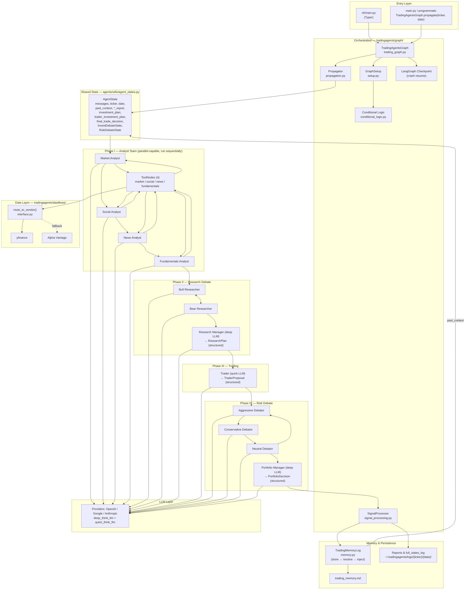
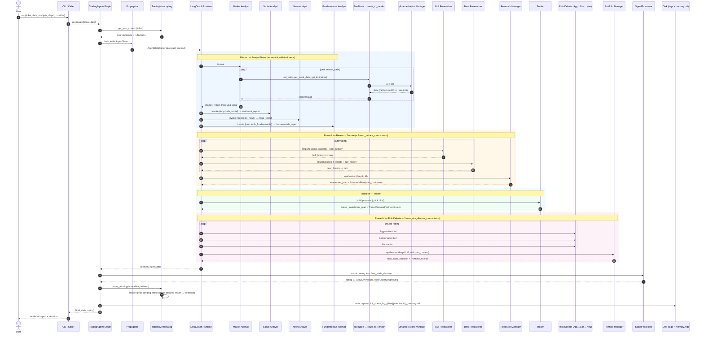

# TradingAgents — Architecture & Sequence Reference

Snapshot of the current system, sufficient to rebuild and to plug an upstream
stock-filter in front of it. Source-of-truth files are referenced inline so you
can verify any block against the code.

---

## 1. Architecture Overview



### Component roles (one-line)

| Component | File | Role |
|---|---|---|
| `TradingAgentsGraph` | `tradingagents/graph/trading_graph.py` | Public façade; `propagate(ticker, date) → (state, decision)` |
| `GraphSetup` | `tradingagents/graph/setup.py` | Builds the LangGraph DAG from selected analysts |
| `Propagator` | `tradingagents/graph/propagation.py` | Seeds initial `AgentState` with ticker/date/past memory |
| `Conditional Logic` | `tradingagents/graph/conditional_logic.py` | Tool-call routing, debate-loop counters |
| `SignalProcessor` | `tradingagents/graph/signal_processing.py` | Parses Portfolio Manager output → 5-tier rating |
| Analysts (×4) | `tradingagents/agents/analysts/` | Pull data via tools, write `*_report` |
| Researchers (Bull/Bear) | `tradingagents/agents/researchers/` | Adversarial debate over the four reports |
| Research Manager | `tradingagents/agents/managers/research_manager.py` | Synthesizes debate → `ResearchPlan` |
| Trader | `tradingagents/agents/trader/` | Converts plan → entry/exit/size proposal |
| Risk Debators (×3) | `tradingagents/agents/risk_mgmt/` | Aggressive / Conservative / Neutral round-robin |
| Portfolio Manager | `tradingagents/agents/managers/portfolio_manager.py` | Final structured decision + rating |
| Data routing | `tradingagents/dataflows/interface.py` | `route_to_vendor()` with rate-limit fallback |
| Memory | `tradingagents/agents/utils/memory.py` | Stores decisions, resolves PnL, injects lessons |

### Rating taxonomy
`Buy | Overweight | Hold | Underweight | Sell` — produced by Portfolio Manager, extracted by `parse_rating()` in `tradingagents/graph/rating.py`.

---

## 2. Sequence Diagram — One Full Run



---

## 3. Public Integration Surface

A pre-stage stock-filter only needs to call the façade per surviving ticker:

```python
from tradingagents.graph.trading_graph import TradingAgentsGraph

ta = TradingAgentsGraph(
    selected_analysts=["market", "social", "news", "fundamentals"],
    config={
        "llm_provider": "openai",
        "deep_think_llm":  "gpt-...",     # used by Research Mgr & Portfolio Mgr
        "quick_think_llm": "gpt-...mini", # analysts, researchers, trader, risk
        "max_debate_rounds": 2,
        "max_risk_discuss_rounds": 1,
        "data_vendors": {"core_stock_apis": "yfinance"},
        "checkpoint_enabled": True,
    },
)

final_state, rating = ta.propagate(ticker="NVDA", trade_date="2026-05-01")
```

`propagate` is idempotent per `(ticker, date)` when checkpointing is on — safe
to retry. The filter can fan tickers out in parallel processes; each run is
self-contained (state + memory keyed by ticker).

### State fields the filter can read after a run
- `final_trade_decision` — full structured PortfolioDecision
- `investment_plan` — Research Manager's plan (entry candidate)
- `trader_investment_plan` — entry/exit/size
- `market_report`, `sentiment_report`, `news_report`, `fundamentals_report`

### Artifacts on disk (per run)
- `~/.tradingagents/logs/{ticker}/{date}/reports/*.md`
- `~/.tradingagents/logs/{ticker}/TradingAgentsStrategy_logs/full_states_log_{date}.json`
- `~/.tradingagents/memory/trading_memory.md` (rolling, cross-ticker)

Override locations via `TRADINGAGENTS_RESULTS_DIR` and `TRADINGAGENTS_MEMORY_LOG_PATH`.

---

## 4. Rebuild Checklist

1. **State schema** — recreate `AgentState` (messages + reports + two debate sub-states + final decision).
2. **Graph builder** — DAG: 4 analysts (each with tool loop + msg-clear) → bull/bear loop → research mgr → trader → 3-way risk loop → portfolio mgr.
3. **Tool layer** — `route_to_vendor` dispatcher with primary + rate-limit fallback; tool categories: stock, indicators, fundamentals (4 statements), news (3 variants).
4. **LLM layer** — split deep vs quick model; structured-output Pydantic schemas for `ResearchPlan`, `TraderProposal`, `PortfolioDecision`; graceful fallback to free-text when provider lacks structured mode.
5. **Loop control** — counter-based conditional edges: debate ≤ `2·max_debate_rounds`, risk ≤ `3·max_risk_discuss_rounds`.
6. **Signal extraction** — deterministic regex on Portfolio Manager output → 5-tier rating.
7. **Memory** — store-pending → resolve-on-next-run (fetch realized return, generate reflection) → inject top-K same-ticker + cross-ticker lessons into PM prompt.
8. **Persistence** — per-run report dir + serialized full state JSON + checkpoint store for crash resume.
