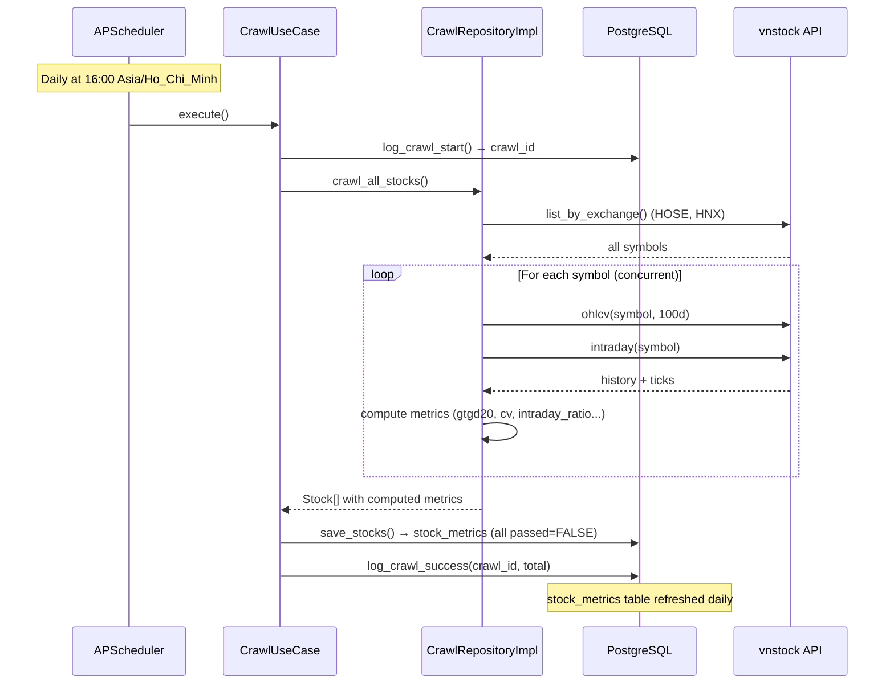
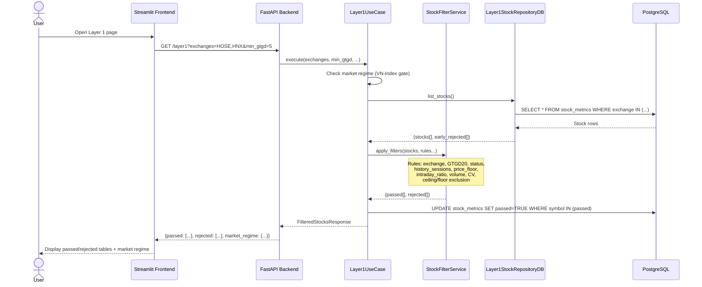
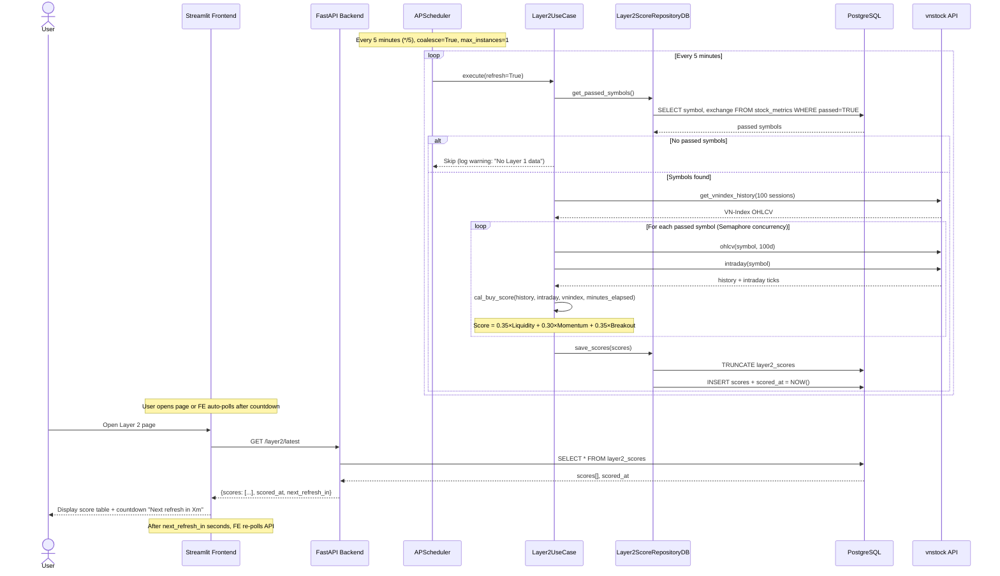
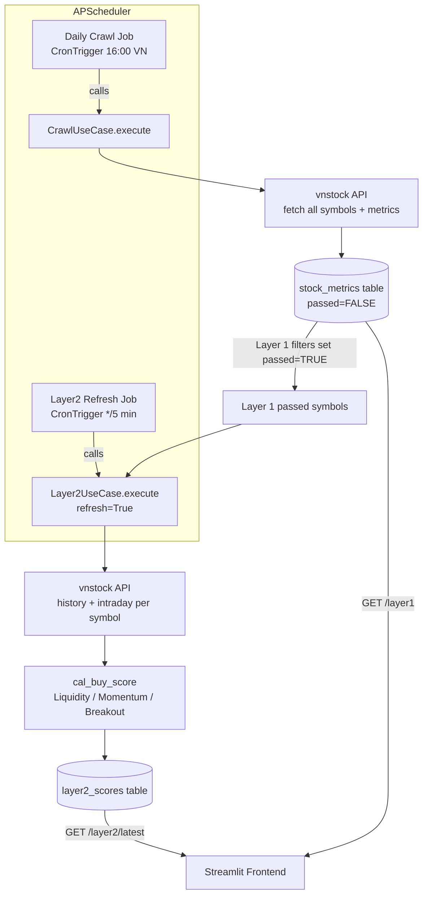
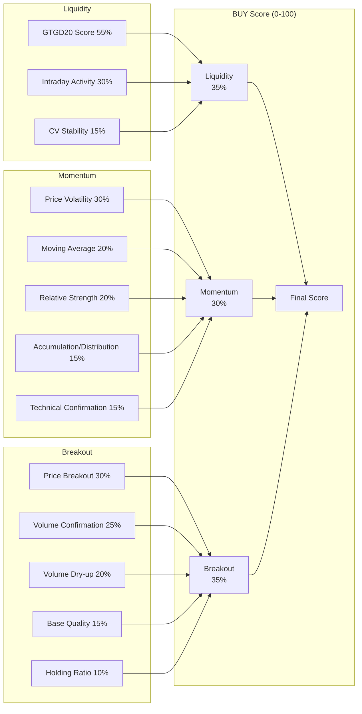

# System Architecture Diagrams

## Overview

This document shows the data flow for the 3 main components: **Daily Crawl**, **Layer 1 Filtering**, **Layer 2 Scoring**, and how the **Scheduler** orchestrates them.

---

## 1. Daily Crawl (Scheduled 16:00 VN time)

---

## 2. Layer 1 — Stock Filtering

---

## 3. Layer 2 — Buy Score (Auto-refresh every 5 minutes)

---

## 4. Scheduler Overview

---

## 5. Score Breakdown (Layer 2)

